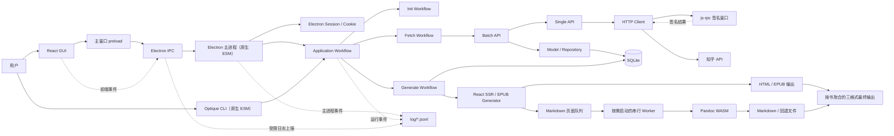

# 架构总览

## 项目定位

知乎助手是一个本地 Electron 桌面应用，同时保留 CLI 能力。GUI 和 CLI 最终复用同一套 application workflow：

```text
任务配置 -> 初始化 -> 抓取知乎数据 -> 写入 SQLite -> 读取数据库 -> 排序与分卷 -> 固定生成 HTML/Markdown/EPUB
```

## 总体分层图（1/7）



边界说明：

1. GUI 不直接访问文件系统、SQLite 或知乎接口，只通过 preload 暴露的白名单 IPC 调用主进程。
2. Electron 主进程负责窗口、session、IPC 和本地系统能力，不承载抓取、持久化或生成细节。
3. GUI 与 CLI 都调用 `RunTaskWorkflow`。GUI 注册 Electron session 与 js-rpc 签名桥；纯 Node CLI 可独立执行 `init/generate`，但 `fetch/run` 若宿主没有注入签名桥，会以稳定的 `SIGNATURE_FAILED` 非零失败。在线测试 runner 也会注册 Electron 签名桥。
4. Electron main、CLI、application、API、model、library 与 shared TypeScript 编译为原生 ESM；包级 `"type": "module"` 和 NodeNext 解析要求相对导入带 `.js` 扩展。sandbox preload 以及必须由 CommonJS 宿主直接执行的构建/测试脚本保留为明确的 `.cjs` 岛，不扩大到业务代码。
5. Pandoc WASM 不进入 Electron 主线程。一次 generate 在首次需要转换时才创建一个 worker，所有书和页面在该 worker 内串行处理，整个生成命令结束后回收；这既隔离同步转换负载，也限制并行 WASM 实例带来的内存增长。
6. 日志契约和常量只服务当前仓库，唯一来源是 `src/shared/logging/log_contract.ts`，不维护前后端两份魔法字符串。

## 目录职责

| 路径                               | 职责                                                    |
| ---------------------------------- | ------------------------------------------------------- |
| `client/src`                       | React GUI、页面状态、IPC 调用与前端诊断事件             |
| `src/index.ts`                     | Electron 主进程、窗口、IPC、session、任务启动与诊断导出 |
| `src/preload.cjs`                  | sandboxed 主窗口 preload，向页面暴露 `window.electronAPI` |
| `src/public/js-rpc`                | 知乎请求签名所需的独立 renderer 与 `preload.cjs`          |
| `src/interface/cli`                | Optique CLI 解析和命令派发                              |
| `src/application/workflow`         | 初始化、抓取、生成和完整运行编排                        |
| `src/api/single`                   | 单个知乎接口请求与响应适配                              |
| `src/api/batch`                    | 分页、子任务扩展、并发抓取和入库编排                    |
| `src/model`                        | SQLite 数据模型和数据浏览摘要                           |
| `src/infrastructure/sqlite/schema` | SQLite 初始化 SQL                                       |
| `src/library`                      | HTTP、EPUB、日志、任务队列、工具函数和知乎签名          |
| `src/application/workflow/generate/library/markdown` | Pandoc worker、串行转换、链接改写和回退文件输出 |
| `src/shared`                       | GUI/CLI workflow 共用的配置、运行上下文和仓库内公共契约 |
| `tests`                            | 单元、前端组件、本地集成、在线测试及其 helper/setup     |
| `fixtures/zhihu`                   | 已脱敏、裁剪并带 schema 的知乎离线 fixture              |
| `scripts/tests`                    | 在线 Electron runner 与 fixture 刷新脚本                |
| `doc/guide`                        | 面向使用者的公开指南                                    |
| `doc/dev`                          | 当前有效的开发、诊断和测试说明                          |
| `doc/项目文档`                     | 历史规划与阶段性设计                                    |

## 当前 GUI 模块

`client/src/page/home` 是 GUI 主入口。

| 页面     | 组件                      | 状态与职责                                                 |
| -------- | ------------------------- | ---------------------------------------------------------- |
| 任务管理 | `component/customer_task` | Ant Design Form、Valtio 状态、自动链接识别、全局跳过抓取、登录检查、生成配置和任务启动；不提供格式选择 |
| 运行日志 | `component/log`           | 阶段状态、本会话错误、最近五日日志、书籍级输出历史、诊断导出 |
| 数据浏览 | `component/db_explorer`   | 数据库摘要、分页列表、父子筛选、摘要和详情                 |
| 登录     | `component/login`         | 内置 webview 登录知乎并复用 Electron session               |
| 调试面板 | `component/debug`         | IPC 调试和前后端日志查看，仅在开发者模式展示               |

页面切换由 `client/src/page/home/resource/context/index.ts` 的 `CurrentTab` context 管理。任务管理和数据浏览分别维护自己的 Valtio store；日志页以 IPC 拉取结构化日志和输出历史。

## 当前后端模块

| 模块       | 文件                                                          | 说明                                        |
| ---------- | ------------------------------------------------------------- | ------------------------------------------- |
| 运行入口   | `src/application/workflow/run_task/run_task_workflow.ts`      | 创建运行上下文，串联 init/fetch/generate    |
| 初始化     | `src/application/workflow/init/init_workflow.ts`              | 创建目录、建表、可选重建数据库              |
| 抓取       | `src/application/workflow/fetch/customer.ts`                  | 合并任务并选择 batch fetcher                |
| 生成       | `src/application/workflow/generate/customer.ts`               | 从 SQLite 组装 Unit、排序、分卷并编排 HTML/Markdown/EPUB |
| Markdown   | `src/application/workflow/generate/library/markdown`          | 独立 worker 中按页面执行 Pandoc、改写链接和生成回退文件 |
| 结构化日志 | `src/shared/logging/log_contract.ts`、`src/library/logger.ts` | 共享事件契约、脱敏、按日 JSONL 和文本日志   |
| 运行上下文 | `src/shared/runtime/run_context.ts`                           | `runId` 与配置、数据库、输出路径            |
| 路径       | `src/config/path.ts`、`src/shared/path/safe_output_path.ts`   | 根路径、格式优先缓存、书籍级输出和 `log` 目录 |
| 任务 schema | `src/shared/config/task_schema.ts`                            | 前后端共享任务类型、生成模式、图片质量和固定三格式常量 |

## 当前技术栈

版本以根目录和 `client/package.json` 为准。

| 层         | 当前技术                                                       |
| ---------- | -------------------------------------------------------------- |
| 运行时     | Node.js 24.x、pnpm 11.x                                        |
| 桌面壳     | Electron 43.3                                                  |
| 前端       | React 19.2、Vite 8.2、Ant Design 6.5、Valtio 2、ahooks 3       |
| CLI        | Optique 1.2                                                    |
| 模块与编译 | 原生 ESM、NodeNext、Babel 8、TypeScript 7；preload/工具脚本保留 `.cjs` |
| 网络       | axios 1.19                                                     |
| 数据库     | SQLite 3 + knex 3                                              |
| 内容生成   | React SSR 模板、HTML、EPUB、sharp 0.35、pandoc-wasm 1.1（Pandoc 3.10） |
| 测试       | Vitest workspace、jsdom、V8 coverage、Electron 在线测试 runner |

安装、构建和测试命令见[开发环境与命令](./environment)，测试数据维护见[测试与 Fixture](./testing-and-fixtures)。
