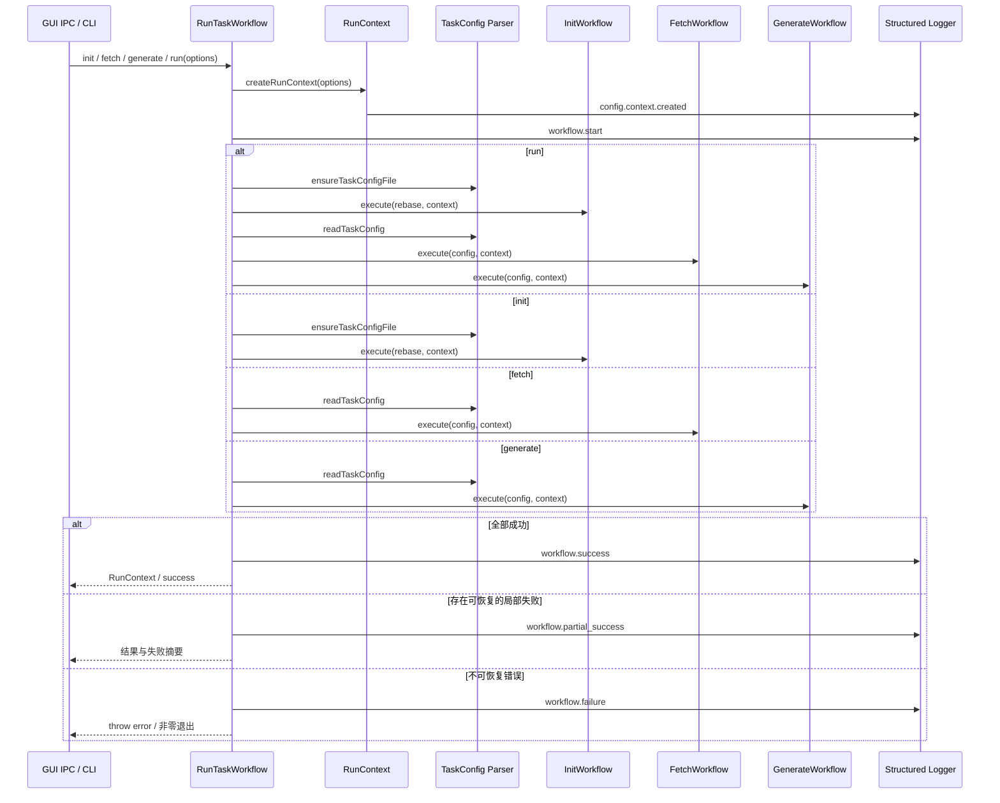
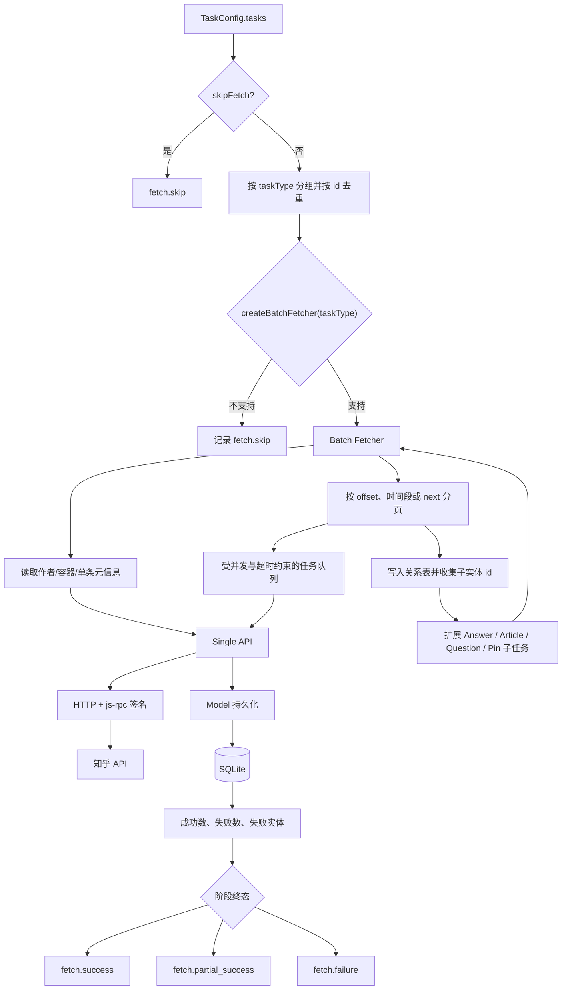
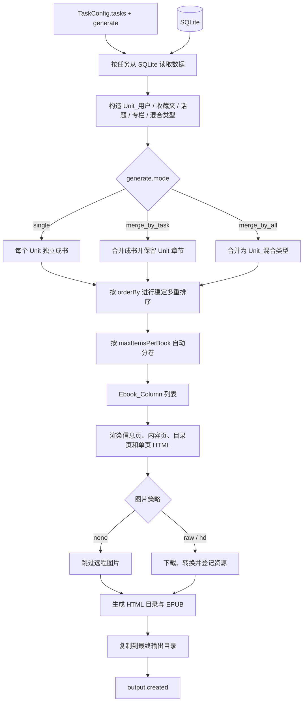

# 业务流程

## 用户侧主流程

GUI 用户先在登录页建立知乎 session，再在任务管理页粘贴链接或批量录入任务，选择生成模式、排序、分卷和图片策略后启动任务。任务执行期间可在运行日志页查看阶段状态；完成后可打开 HTML/EPUB、查看最近五日输出历史或导出诊断信息。CLI 用户通过配置文件执行相同的 workflow。

## RunTaskWorkflow 时序图（4/7）

`src/application/workflow/run_task/run_task_workflow.ts` 是 GUI 和 CLI 共用的应用入口。四个命令共享运行上下文和终态规则，但执行阶段不同。

一次阶段执行必须先产生 `start`，随后恰好产生一个终态：`success`、`failure` 或 `partial_success`。`skip` 表示配置明确跳过或不适用，不可用来掩盖异常。状态与事件码必须引用 `src/shared/logging/log_contract.ts` 中的常量。

阶段 envelope 只反映本阶段结果。`GenerateWorkflow.execute()` 显式返回本次生成的 `success` 或 `partial_success`，`RunTaskWorkflow.runStage()` 优先使用该返回值，因此上游抓取已经局部成功时，后续生成若完整完成仍记录 `generate.success`；整次 run 的总体状态继续保留上游的 `partial_success`。

## 抓取与持久化流程图（5/7）

抓取层分工：

1. `FetchWorkflow` 合并任务、跳过 `skipFetch`、选择 `src/api/batch/*` 实现。
2. batch 层处理分页、活动时间段、关系记录和子任务扩展。
3. single 层只负责端点参数和响应适配，公共请求由 `src/library/http/index.ts` 完成。
4. model 层写入主表与关系表；持久化事件使用 `persist.*`。
5. 不可恢复错误必须向上抛出。允许继续处理的单项失败最终必须汇总为 `partial_success`，不得写成整体成功。

分页响应必须显式区分“正常空页”和“响应损坏”：single API 只接受顶层对象中的 `data` 数组，`{ data: [] }` 是合法空页，缺失 `data`、`null`、对象或顶层数组都会以 `PAGINATION_RESPONSE_INVALID` 失败。所有用于安排分页的数量字段都必须是非负整数，不会再把缺失、小数、负数或非数值当成 0。收藏夹优先校验 `item_count`；仅在该字段缺失时才兼容校验 `answer_count` 并记录警告，数量校验通过后才持久化收藏夹元信息。

## 任务类型差异

任务类型的唯一入口是 `src/application/workflow/fetch/customer.ts` 的 `createBatchFetcher`。不同任务共用上面的流程图，差异如下。

| `task.type`             | Batch 实现                | 分页或子任务扩展                                   | 主要持久化数据                               | 生成 Unit / Page                  |
| ----------------------- | ------------------------- | -------------------------------------------------- | -------------------------------------------- | --------------------------------- |
| `author-ask-question`   | `author_ask_question.ts`  | 分页读取用户提问，再抓每个问题下的回答             | `Author`、`Author_Ask_Question`、`Answer`    | `Unit_用户` / `Page_Question`     |
| `author-answer`         | `author_answer.ts`        | 分页收集用户回答 id，再批量抓回答                  | `Author`、`Answer`                           | `Unit_用户` / `Page_Question`     |
| `author-article`        | `author_article.ts`       | 分页收集文章 id，再批量抓文章                      | `Author`、`Article`                          | `Unit_用户` / `Page_Article`      |
| `author-pin`            | `author_pin.ts`           | 分页收集想法 id，再批量抓想法                      | `Author`、`Pin`                              | `Unit_用户` / `Page_Pin`          |
| `author-agree-answer`   | `author_activity.ts`      | 按月抓活动；从活动扩展赞同回答                     | `Author`、`Activity`、`Answer`               | `Unit_用户` / `Page_Question`     |
| `author-agree-article`  | `author_activity.ts`      | 按月抓活动；从活动扩展赞同文章                     | `Author`、`Activity`、`Article`              | `Unit_用户` / `Page_Article`      |
| `author-watch-question` | `author_activity.ts`      | 按月抓活动；从活动扩展关注问题及其回答             | `Author`、`Activity`、`Answer`               | `Unit_用户` / `Page_Question`     |
| `block-account-answer`  | `block_account_answer.ts` | 使用销号用户信息端点，分页收集并抓取回答           | `Author`、`Answer`                           | `Unit_用户` / `Page_Question`     |
| `topic`                 | `topic.ts`                | 分页读取话题精华回答，再抓完整回答                 | `Topic`、`Topic_Answer`、`Answer`            | `Unit_话题` / `Page_Question`     |
| `collection`            | `collection.ts`           | 分页读取混合收藏记录，并分派回答、文章、想法子任务 | `Collection`、`Collection_Record` 及三类主表 | `Unit_收藏夹` / 三类 Page         |
| `column`                | `column.ts`               | 分页读取文章摘要，再批量抓完整文章                 | `Column`、`Article`                          | `Unit_专栏` / `Page_Article`      |
| `article`               | `article.ts`              | 单条读取                                           | `Article`                                    | `Unit_混合类型` / `Page_Article`  |
| `question`              | `question.ts`             | 读取问题元信息，分页收集并抓取全部回答             | `Answer`；问题信息保存在回答原始数据中       | `Unit_混合类型` / `Page_Question` |
| `answer`                | `answer.ts`               | 单条读取                                           | `Answer`                                     | `Unit_混合类型` / `Page_Question` |
| `pin`                   | `pin.ts`                  | 单条读取                                           | `Pin`                                        | `Unit_混合类型` / `Page_Pin`      |

三个 activity 类型目前共用 `BatchFetchAuthorActivity`：一次抓取会建立活动记录并解析回答、文章和关注问题。生成阶段再按原始 `task.type` 选择对应内容。`mix` 是生成期内部 Unit 类型，不是用户可配置的抓取任务。

## 生成与输出流程图（6/7）

核心概念：

| 概念          | 当前实现                                                              | 说明                                  |
| ------------- | --------------------------------------------------------------------- | ------------------------------------- |
| Page          | `Page_Question`、`Page_Article`、`Page_Pin`                           | 一类可渲染内容页                      |
| Unit          | `Unit_用户`、`Unit_收藏夹`、`Unit_话题`、`Unit_专栏`、`Unit_混合类型` | 一组内容页及其信息页                  |
| Ebook_Column  | `Ebook_Column`                                                        | 自动分卷后的单本书                    |
| HtmlRender    | `src/application/workflow/generate/library/html_render`               | React 服务端渲染模板                  |
| EpubGenerator | `src/application/workflow/generate/library/epub_generator.ts`         | HTML、图片、清单、EPUB 和最终文件输出 |

排序配置会逆序应用，以保持多重排序优先级。分卷边界必须覆盖 0、`max-1`、`max`、`max+1`、多 Unit 和单个 Unit 跨卷场景，详见[测试与 Fixture](./testing-and-fixtures)。

输出路径在进入缓存和最终目录前统一经过 `src/shared/path/safe_output_path.ts`：先进行 Unicode NFKC 规范化，再替换 Windows 非法字符、路径分隔符和 `..`，处理保留设备名及结尾点/空格，并确认解析结果仍在指定输出根目录内。文件名最长 120 个字符；超长标题使用标题前缀加稳定 SHA-256 摘要，分卷名在清理前使用 `_1-of-2卷`、`_2-of-2卷` 形式，因此长标题的不同卷不会截断成同名。书内显示标题仍保留原始名称，安全名称只用于目录和 `.epub` 文件。

HTML 输出目录复制不使用 `fs.cpSync`。Node.js 24 在 Windows 上向含中文等非 ASCII 字符的目标路径执行该调用可能直接结束进程，因此当前实现使用 `readdirSync` 递归遍历并逐文件 `copyFileSync`；复制失败按普通异常进入生成失败链路，不得改回未经验证的 `fs.cpSync`。

单文件 HTML 把目录转换为确定性的页内锚点，并将每个 Unit 信息页和内容页包裹为对应锚点目标。桌面宽度下目录是可折叠的固定侧栏；窄屏下回到正文顶部。多文件 HTML 和 EPUB 仍使用相对文件链接。用户、专栏、收藏夹、话题和混合任务的信息页展示模型中已有的描述字段；字段为空时不渲染空白正文面板。

EPUB 打包遵守三个文件级约束：根目录的 `mimetype` 必须是 ZIP 第一项且使用 STORE（不压缩）；OPF/TOC 的文本和属性分别进行 XML 转义；图片清单按 `.jpg/.jpeg/.png/.gif/.webp/.svg` 写入真实 MIME。封面只登记一次，下载缺失的图片不会进入 manifest；若正文仍成功生成但存在缺图，生成与 `output.created` 记录为 `partial_success`，以便 GUI 明确展示告警产物。

## 数据浏览链路

数据浏览页通过 `get-db-summary-info` 获取各实体数量，通过 `get-db-record-list(type, pageNo, pageSize, parentId)` 获取列表。主进程调用 `src/model/summary.ts`，后者查询 SQLite，并把行数据转换为统一的摘要、作者、来源链接和详情 HTML；前端不直接理解 SQLite 表结构。
