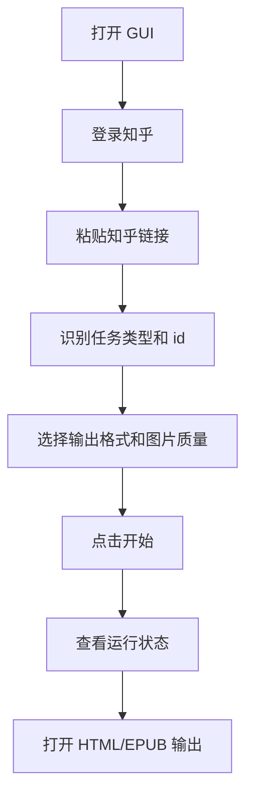
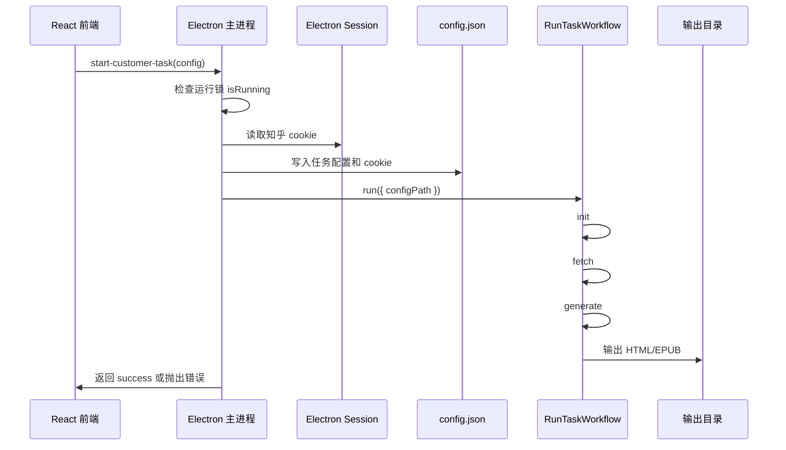
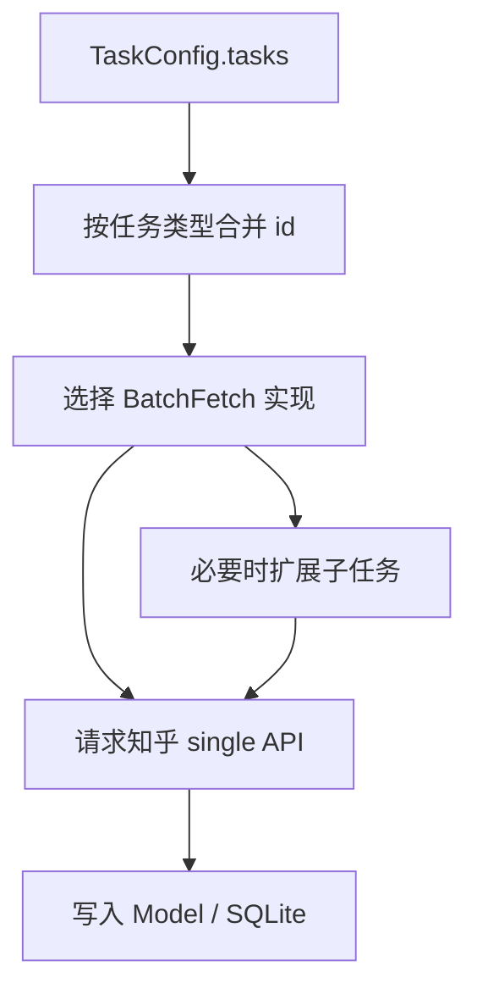
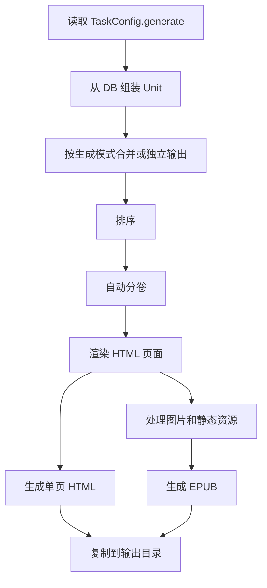
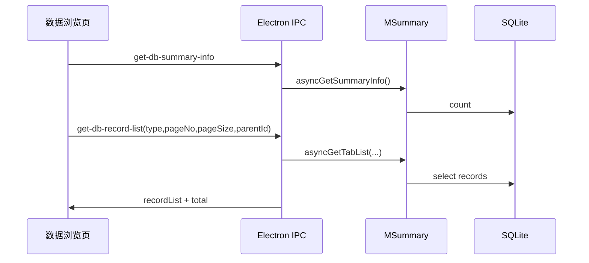

# 业务流程

## 用户侧主流程



## GUI 启动任务流程



## CLI 完整流程

```text
pnpm build
pnpm zhihuhelp run --config config.json
```

`run` 会顺序执行：

1.  创建 `RunContext`，写入 `runId`，同步路径配置。
2.  检查并读取任务配置。
3.  初始化目录和数据库。
4.  抓取知乎数据并写入 SQLite。
5.  从 SQLite 读取内容并生成 HTML / EPUB。
6.  写入运行日志和输出结果记录。

## 抓取流程



关键实现：

1.  `FetchWorkflow.execute` 接收旧结构任务配置。
2.  `mergeTaskList` 将同类型任务合并，跳过 `skipFetch` 的任务。
3.  `createBatchFetcher` 根据任务类型选择 `src/api/batch/*`。
4.  batch 层请求 `src/api/single/*` 并调用 `src/model/*` 入库。
5.  过程通过 `Logger.event` 写入结构化日志。

## 生成流程



核心概念：

| 概念 | 当前实现 | 说明 |
| --- | --- | --- |
| Page | `Page_Question`、`Page_Article`、`Page_Pin` | 电子书内容页 |
| Unit | `Unit_用户`、`Unit_收藏夹`、`Unit_话题`、`Unit_专栏`、`Unit_混合类型` | 一组内容页和信息页 |
| Ebook_Column | `Ebook_Column` | 一本或一卷电子书 |
| HtmlRender | `html_render` | React 模板渲染 HTML |
| EpubGenerator | `epub_generator.ts` | 资源处理、HTML/EPUB 输出 |

## 数据浏览流程



数据浏览的核心在 `src/model/summary.ts`。它把数据库记录转换为前端可展示的摘要、详情 HTML、作者信息和统计字段。

