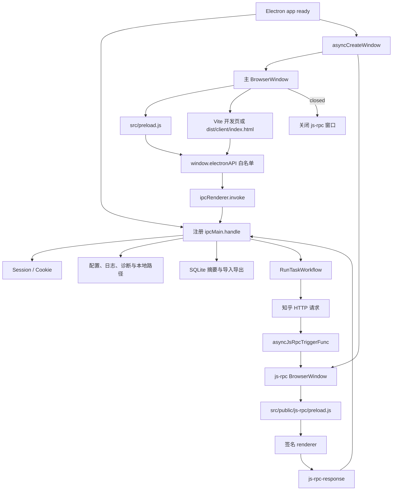
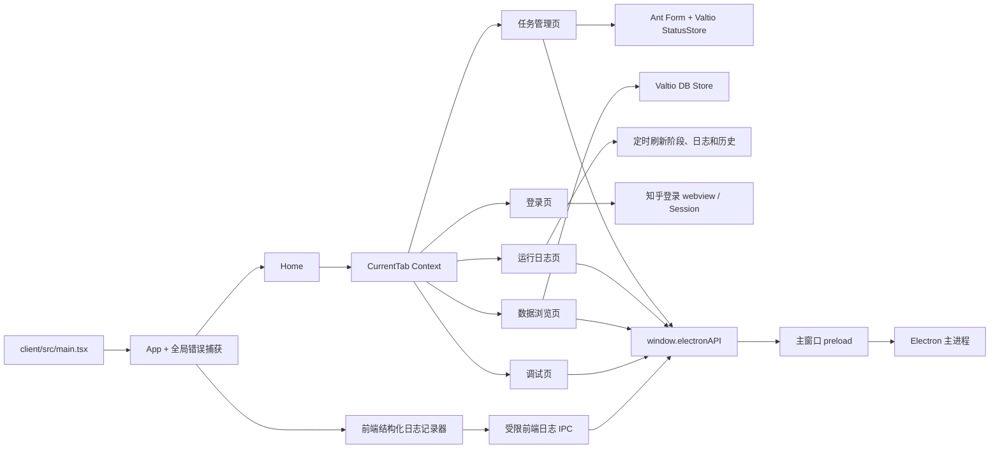

# 前端 / Electron / 后端分工

## 总原则

GUI 是本地任务控制台。React renderer 负责展示和交互；preload 只暴露白名单方法；Electron 主进程负责窗口、session、IPC、文件系统和 workflow 入口；application、API 与 model 层负责业务执行。前端不得直接读取文件、访问 SQLite 或携带 Cookie 请求知乎。

## Electron 启动与窗口关系图（2/7）

开发模式下主窗口加载 `http://localhost:8080`，生产构建加载 `dist/client/index.html`。普通生产运行中 js-rpc 窗口默认隐藏；`pnpm test:online` 与 `pnpm fixtures:refresh` 允许显示该窗口和专用日志，以便排查签名或请求失败，但它们不执行真实 UI E2E。

## 前端页面、状态与 IPC 调用图（3/7）

页面状态约定：

1. `CurrentTab` 只负责当前页签；不要把业务实体塞进全局 context。
2. 任务管理页的表单值与执行状态分开管理；提交前完成 URL、任务类型和必填字段校验。
3. 运行日志页按最新 `runId` 计算阶段状态，并只展示最近五个自然日内的输出历史。
4. 数据浏览页通过摘要和分页 IPC 获取展示模型，不直接消费 SQLite 行。
5. 前端日志记录应用启动、页面切换、关键操作、IPC、React Error Boundary、`error` 和 `unhandledrejection`；不记录普通输入过程或高频 render。
6. 普通业务 IPC 由 `DebugLog.invokeElectronApi` 在末参数附加 `{ __zhihuhelpTraceId }`，主进程沿用该值；日志读取轮询和 `append-frontend-log-batch` 自身走 silent/passive 路径。
7. 任务配置读取失败或返回非法 schema 时，任务页保留安全默认表单、显示“任务配置不可用”错误，并禁用启动按钮，不能以默认值继续覆盖 `config.json`。
8. 数据库摘要和记录列表分别维护 loading、failure 与真实空数据状态；SQLite/解析/IPC 异常显示错误 Alert 和“暂无可用”占位，不得伪装成“当前分类没有记录”。

## 前端职责

路径：`client/src`

前端负责：

1. 登录状态展示和用户引导。
2. 链接识别、任务录入、表单校验和配置适配。
3. 展示运行阶段、最近日志、输出历史和诊断结果。
4. 展示数据库摘要、分页列表和详情。
5. 生成经过共享契约校验、脱敏和限长的前端诊断事件。

前端不得：

1. 直接读取或写入本地文件、SQLite。
2. 绕过主进程直接请求知乎。
3. 把 Cookie、Authorization、完整请求头或完整响应正文写入 localStorage、JSONL、快照或测试报告。
4. 让“日志上报 IPC”再次触发通用 IPC recorder，形成递归日志。

## Electron 主进程职责

路径：`src/index.ts`、`src/preload.js`

Electron 负责：

1. 创建并回收主窗口和 js-rpc 窗口。
2. 管理知乎 session、Cookie 与请求签名桥。
3. 注册白名单 IPC，校验来自 renderer 的 payload。
4. 读取、写入任务配置并启动 `RunTaskWorkflow`。
5. 管理任务运行锁，避免重复启动。
6. 提供日志、最近五日输出历史、数据库摘要、导入导出和诊断文件能力。
7. 把前端事件写入独立的按日 JSONL；renderer 不能指定文件路径。

日志写入失败必须降级到安全的控制台/stderr 路径，不能覆盖原始业务异常。`PathConfig.rootPath/log` 是本仓库约定的默认目录；测试通过注入将其切换到临时目录。

## 后端职责

路径：`src/application`、`src/api`、`src/model`、`src/library`、`src/shared`

后端负责：

1. 解析配置并初始化目录和 SQLite。
2. 请求知乎接口，执行分页、子任务扩展和持久化。
3. 从 SQLite 组织回答、文章、想法及其关系。
4. 排序、分卷、渲染 HTML 并生成 EPUB。
5. 使用共享日志契约记录可关联、可脱敏、可判定终态的结构化事件。
6. 区分不可恢复错误与可恢复的局部失败，不得用空结果伪装成功。

后端不依赖前端页面状态。CLI 和 GUI 复用同一套 workflow；GUI 及在线测试 runner 会注册 Electron 签名桥。纯 Node CLI 的 `init/generate` 不需要该桥，`fetch/run` 在宿主未注入签名桥时以 `SIGNATURE_FAILED` 非零失败。本期不让 CLI 自动启动 Electron；若要支持 CLI 独立真实抓取，应单列后续需求。

## IPC 列表

IPC 公开面由 `src/preload.js` 与 `src/renderer.d.ts` 共同约束。新增或改名时必须同时更新两处和本表。

| IPC                           | 主要调用方         | 用途与边界                                             |
| ----------------------------- | ------------------ | ------------------------------------------------------ |
| `get-debug-ipc-channel-list`  | 调试面板           | 获取调试标志、进程信息和允许展示的 IPC 列表            |
| `get-common-config`           | 任务管理           | 读取任务配置；前端日志不得保存其中的 Cookie            |
| `start-customer-task`         | 任务管理           | 合并 session Cookie、保存配置并启动完整任务            |
| `get-task-default-title`      | 任务管理           | 根据任务类型和 id 获取默认书名                         |
| `zhihu-http-get`              | 任务管理、调试     | 由主进程代理最小知乎 GET 请求                          |
| `open-output-dir`             | 任务管理、运行日志 | 打开默认输出目录                                       |
| `open-local-path`             | 运行日志           | 校验后打开文件或定位目录                               |
| `clear-all-session-storage`   | 任务管理           | 清除 Electron 登录状态                                 |
| `get-db-summary-info`         | 数据浏览           | 获取数据库实体汇总                                     |
| `get-db-record-list`          | 数据浏览           | 获取带可选父级筛选的分页展示模型                       |
| `export-db-record-json`       | 数据浏览           | 导出选定记录；SQLite 缺表/查询错误或损坏 `raw_json` 会拒绝 IPC，不生成空数据成功文件 |
| `import-db-record-json`       | 数据浏览           | 严格要求 `records/indexes/relations` 数组；全部条目无效时拒绝 IPC，部分写入返回 `partial_success` 并刷新摘要/列表，选择器取消则正常返回 `canceled` |
| `get-log-content`             | 运行日志           | 读取最近文本日志                                       |
| `clear-log-content`           | 运行日志           | 清理文本日志文件族                                     |
| `get-runtime-jsonl-content`   | 运行日志、调试     | 合并读取最近五日后端 JSONL                             |
| `clear-runtime-jsonl-content` | 运行日志           | 清理后端 JSONL 文件族                                  |
| `get-output-history`          | 运行日志           | 从最近五日 `output.created` 事件按规范化路径去重构建历史 |
| `export-diagnostic-info`      | 运行日志           | 导出脱敏配置、摘要及前后端日志尾部                     |
| `open-devtools`               | 调试               | 打开主窗口 DevTools                                    |
| `open-js-rpc-window-devtools` | 调试               | 显示 js-rpc 窗口并打开 DevTools                        |
| `append-frontend-log-batch`   | 全局日志记录器     | 每批接收 1–20 条前端事件；固定目标文件、单条最多 64 KiB；error 立即刷新 |

缓存 JSON 导入除顶层三个数组外还校验条目形状：每个 record/index 的 `raw`、`db.columns` 以及 collection relation 的 `raw`、`db.columns` 都必须是普通对象，标量和数组会在写数据库前计入 skipped，不得产生半条或污染记录。全部条目无效返回 failure；合法与非法条目混合时只写入合法项并返回 `partial_success`，前端随后刷新摘要和当前列表。

## 新增能力时的边界

新增前端能力前先判断它属于 UI 状态、系统能力还是业务流程：UI 状态留在 renderer；文件、窗口、session 留在主进程；抓取、生成、入库留在 workflow/API/model。确需新增 IPC 时：

1. 普通关键 IPC 使用 `runLoggedIpc` 或等价的显式起止记录，产生一个 `ipc.request.start` 和一个终态。renderer 创建并传入 `traceId`，主进程为受日志包装的请求派生稳定 `jobId`；`start-customer-task` 还创建 `runId` 并把三者带入 workflow。没有 workflow 的只读请求不伪造 `runId`。`runLoggedIpc` 会把 handler 已 resolve 的 `{ status: 'failure' }` 转换为 rejected IPC，使主进程与 renderer 都记录 failure；`{ status: 'canceled' }` 表示用户主动取消，保持正常 resolved 结果，不作为错误。
2. preload 只暴露明确参数的方法，不开放任意 channel 或任意文件路径。
3. 有业务 payload 的入口在执行前校验对象形状和字段范围；当前包括任务配置、默认标题、数据库分页/导出和本地输出路径。非法 payload 抛出可诊断错误并记录唯一 failure，不得继续写配置、查询数据库或访问任意路径。
4. 请求和响应在写日志前脱敏、摘要化并限制单条大小。
5. `get-output-history`、日志读取轮询与 `append-frontend-log-batch` 是防递归的被动通道，不产生通用 IPC 起止事件；后者只记录 accepted/rejected 接收结果。
6. 同步修改 `src/index.ts`、`src/preload.js`、`src/renderer.d.ts`、调试面板和本文档。
