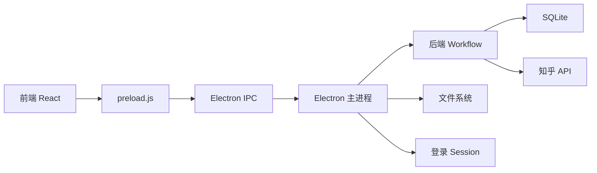

# 前端 / Electron / 后端分工

## 总原则

当前项目的 GUI 是本地任务控制台，不直接访问文件系统和知乎接口。前端通过 `window.electronAPI` 调用 Electron 主进程，主进程再调用本地文件、知乎请求、数据库和 workflow。

## 前端职责

路径：`client/src`

前端负责用户可见的状态和交互：

1.  登录状态展示和用户引导。
2.  链接输入、任务识别、表单校验。
3.  输出格式、图片质量、生成模式、排序、分卷等配置项。
4.  调用 IPC 启动任务。
5.  展示运行阶段、原始日志、输出历史。
6.  展示数据库摘要、列表、摘要卡片和详情。
7.  隐藏普通用户不需要的调试入口。

前端不应该：

1.  直接读取本地文件。
2.  直接请求知乎接口。
3.  直接写 SQLite。
4.  在浏览器侧保存敏感 cookie。

## Electron 主进程职责

路径：`src/index.ts`、`src/preload.js`

Electron 负责连接前端、本地系统和后端 workflow：

1.  创建主窗口和 js-rpc 子窗口。
2.  管理知乎登录 session 和 cookie。
3.  暴露 IPC 给前端。
4.  读取和写入任务配置。
5.  启动 `RunTaskWorkflow`。
6.  管理任务运行锁，避免重复启动。
7.  读取日志、输出历史和数据库摘要。
8.  打开输出目录、本地文件或诊断文件。

Electron 不应该长期承载复杂业务逻辑。抓取、生成、入库等逻辑应留在 application workflow 和模型层。

## 后端职责

路径：`src/application`、`src/api`、`src/model`、`src/library`

后端负责真实任务执行：

1.  初始化目录和 SQLite。
2.  请求知乎接口。
3.  写入和读取 SQLite。
4.  组织回答、文章、想法等内容。
5.  排序、分卷、渲染 HTML。
6.  生成 EPUB。
7.  记录文本日志和结构化日志。

后端不应该依赖前端页面状态。CLI 和 GUI 都应能复用同一套 workflow。

## 当前 IPC 列表

| IPC                           | 调用方             | 用途                           |
| ----------------------------- | ------------------ | ------------------------------ |
| `get-debug-ipc-channel-list`  | 调试面板           | 获取可调试 IPC 列表            |
| `get-common-config`           | 任务管理           | 读取本地任务配置               |
| `start-customer-task`         | 任务管理           | 保存配置并启动完整任务         |
| `get-task-default-title`      | 任务管理           | 根据任务类型和 id 获取默认书名 |
| `zhihu-http-get`              | 任务管理、调试     | 通过主进程代理知乎 GET 请求    |
| `open-output-dir`             | 任务管理、运行日志 | 打开默认输出目录               |
| `clear-all-session-storage`   | 任务管理           | 清空 Electron 登录状态         |
| `get-log-content`             | 运行日志           | 读取 `runtime.log`             |
| `clear-log-content`           | 运行日志           | 清空 `runtime.log`             |
| `get-runtime-jsonl-content`   | 运行日志、调试     | 读取 `runtime.jsonl`           |
| `clear-runtime-jsonl-content` | 运行日志           | 清空 `runtime.jsonl`           |
| `get-output-history`          | 运行日志           | 从结构化日志构建输出历史       |
| `export-diagnostic-info`      | 运行日志           | 导出诊断 JSON                  |
| `open-local-path`             | 运行日志           | 打开或定位指定本地路径         |
| `get-db-summary-info`         | 数据浏览           | 获取数据库汇总数量             |
| `get-db-record-list`          | 数据浏览           | 获取分页数据列表               |
| `open-devtools`               | 调试               | 打开主窗口 DevTools            |
| `open-js-rpc-window-devtools` | 调试               | 打开 js-rpc 子窗口和 DevTools  |

## 新增能力时的边界

新增前端功能时优先检查：

1.  是否已有 IPC 可复用。
2.  是否只需要扩展返回数据，而不是新增通道。
3.  是否应该放在 workflow 或 model 中，而不是塞进 `src/index.ts`。

如果确实需要新增 IPC，建议按三类设计：

1.  任务运行状态。
2.  输出结果。
3.  诊断信息。

并同步更新：

1.  `src/preload.js`
2.  `src/renderer.d.ts`
3.  本文档的 IPC 列表

