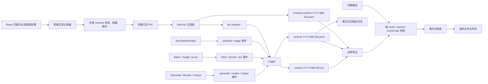

# 数据与日志

## 运行路径

默认路径由 `src/config/path.ts` 管理。这里的 `PathConfig.rootPath` 约定只服务当前仓库；测试必须注入临时根目录，不得写入这些业务路径。

| 路径                                      | 说明                                                   |
| ----------------------------------------- | ------------------------------------------------------ |
| `缓存文件`                                | 生成过程缓存根目录                                     |
| `缓存文件/imgPool`                        | 图片缓存                                               |
| `缓存文件/html`                           | HTML 生成缓存                                          |
| `缓存文件/epub`                           | EPUB 生成缓存                                          |
| `知乎助手输出的电子书/html`               | HTML 最终输出                                          |
| `知乎助手输出的电子书/epub`               | EPUB 最终输出                                          |
| `config.json`                             | 当前任务配置，包含敏感 Cookie，不得进入日志或 fixture  |
| `log/runtime.YYYY-MM-DD.log`              | 后端人类可读日志                                       |
| `log/runtime.YYYY-MM-DD.jsonl`            | 后端结构化运行日志                                     |
| `log/frontend.runtime.YYYY-MM-DD.jsonl`   | renderer 通过受限 IPC 上报的结构化日志                 |

日志文件名使用运行机器的本地自然日。每个文件族各保留最近 5 个日期文件，超过后删除较旧日期；单个日期文件不设置体积上限。应用跨日运行时，下一条事件自动切换到新文件。由于安装目录可能不可写，日志写入异常必须安全降级，不能掩盖业务错误。

生产和调试运行都记录错误与关键链路事件；调试模式可以增加 `info/debug` 诊断，但仍执行相同的脱敏、限长和保留规则。

## SQLite

数据库使用 `knex + sqlite3`，初始化 SQL 位于 `src/infrastructure/sqlite/schema/init.sql`。

| 表                    | 说明                                                   |
| --------------------- | ------------------------------------------------------ |
| `Answer`              | 回答原始数据及内嵌的问题、作者索引                     |
| `Article`             | 文章原始数据及专栏、作者索引                           |
| `Pin`                 | 想法原始数据及作者索引                                 |
| `Author`              | 作者信息                                               |
| `Column`              | 专栏信息                                               |
| `Activity`            | 用户活动记录                                           |
| `Collection`          | 收藏夹信息                                             |
| `Collection_Record`   | 收藏夹与回答、文章、想法的关系                         |
| `Topic`               | 话题信息                                               |
| `Topic_Answer`        | 话题与回答的关系                                       |
| `Author_Ask_Question` | 用户提问关系；问题详情仍从关联回答的原始数据恢复       |

大部分主表保留 `raw_json`，生成和数据浏览阶段再转换知乎原始字段。测试数据库必须放在独立临时目录，并在结束时销毁 knex 连接。

## 数据浏览模型

`src/model/summary.ts` 是 GUI 数据浏览的后端入口：

| 方法                    | 说明                                                     |
| ----------------------- | -------------------------------------------------------- |
| `asyncGetSummaryInfo()` | 返回回答、文章、想法、用户、问题、收藏夹、专栏、话题数量 |
| `asyncGetTabList()`     | 根据分类、分页和可选 `parentId` 返回统一展示模型          |

展示模型常用字段包括 `recordKind`、`title/name`、`description`、`contentHtml`、`originContentHtml`、`sourceUrl`、`author`、互动数和创建/更新时间。前端不得依赖具体 SQLite 行或 `raw_json` 结构。

## 日志汇聚与故障定位图（7/7）

推荐排查顺序：先确定发生日期和 `runId`，再按失败事件的 `eventCode` 查诊断表；涉及 IPC 或签名时继续按 `traceId/jobId` 串联前端、主进程和 js-rpc 事件；最后查看同一阶段的 `details`、`error` 和前一个成功事件。

## 共享日志契约

唯一契约位于 `src/shared/logging/log_contract.ts`。前端、主进程、workflow 和测试都引用同一组字段与常量，不根据中文 `message` 判断业务状态。

调用点应优先使用共享的 `LogStage`、`LogStatus`、`LogLevel` 和 `LogEventCode` 常量。具有独立业务语义的事件（例如 `config.context.created`、`output.created`）显式传入 `eventCode`；常规阶段事件可以只传共享 `stage/status`，由 `createStructuredLogRecord()` 统一派生同名 `${stage}.${status}` 事件码。两种写法生成相同的稳定记录，不要求每个调用点重复显式传入阶段事件常量，也不得在调用点散落字符串字面量。

| 字段            | 要求     | 说明                                                                  |
| --------------- | -------- | --------------------------------------------------------------------- |
| `schemaVersion` | 必填     | 日志 schema 版本，解析器据此处理兼容性                                |
| `triggerAt`     | 必填     | ISO 8601 事件时间；文件日期仍按本地自然日                              |
| `eventCode`     | 必填     | 小写点分稳定事件码，例如 `fetch.failure`                               |
| `source`        | 必填     | 模块或功能域，用于映射源码                                             |
| `stage`         | 关键事件 | `app/frontend/cli/config/init/fetch/persist/generate/render/output/ipc/rpc` 等阶段 |
| `status`        | 关键事件 | `start/progress/success/partial_success/skip/failure`                  |
| `level`         | 必填     | `debug/info/warn/error`                                                |
| `message`       | 必填     | 面向人的简短描述，不作为程序判断条件                                   |
| `runId`         | 按需     | 一次 workflow 运行的关联 id                                            |
| `traceId`       | 按需     | 一次 renderer → IPC → 后端调用的关联 id                                |
| `jobId`         | 按需     | 分页任务、签名任务或并发队列任务 id                                    |
| `taskType`      | 按需     | 任务类型                                                               |
| `entityType`    | 按需     | 故障实体类别                                                           |
| `entityId`      | 按需     | 故障实体摘要；遵循脱敏规则                                             |
| `durationMs`    | 终态建议 | 从对应 `start` 到终态的耗时                                            |
| `errorCode`     | 按需     | 仓库内共享的机器可判定错误码，不使用散落的魔法字符串                   |
| `details`       | 按需     | 已脱敏、限长的结构化摘要                                               |
| `error`         | 失败必填 | 标准化的 `name/message/stack/code`；不得包含 Cookie 或完整响应正文      |

阶段规则：

1. 每个关键操作先写一个 `start`，最终恰好写一个 `success`、`partial_success` 或 `failure`。
2. `partial_success` 必须包含成功数、失败数和失败实体摘要；不可恢复错误必须抛出并使命令失败。
3. `progress` 可用于分页或渲染进度，但不得逐条输出高频状态。
4. `skip` 只用于配置明确跳过或场景不适用。
5. 日志自身写入失败不得递归记录，也不得替换正在处理的原始异常。

`RunTaskWorkflow` 的 canonical 阶段 envelope 使用 `stage-{stage}-{action}` 作为 `jobId`，配置创建/读取分别使用 `config-ensure-{action}` 与 `config-read-{action}`；这样同一 `runId` 下不同命令动作的 start 与唯一终态可以独立配对。运行日志页按 `stage-`、`config-ensure`、`config-read` 前缀识别这些 canonical 记录，再由它们决定阶段终态；实体、HTTP 等可恢复子任务的独立 failure 不会越过阶段汇总直接把整次运行判为失败。

## 结构化日志事件诊断表

事件码采用小写点分领域前缀。下表既是检索入口，也是事件码与源码入口的稳定映射；新增事件必须同步更新共享常量、测试和本表。

| 事件码 | 主要源码入口 | 含义与排查方向 |
| ------ | ------------ | -------------- |
| `runtime.generic` | `Logger.event` 的兼容兜底 | 仅用于尚未迁移的通用事件；关键链路不得长期依赖它，应补充明确事件码。 |
| `app.start` | `src/index.ts`、`client/src/main.tsx` | 进程或 renderer 已启动；缺失时检查启动参数、资源路径和根组件挂载。 |
| `app.error` | 主进程全局异常处理、React Error Boundary、`error`/`unhandledrejection` | 未捕获异常；先按 `source` 区分 main/renderer，再检查 `error.stack`。 |
| `frontend.app.start` `frontend.route.change` `frontend.action` | `client/src/main.tsx`、`client/src/page/home/index.tsx` 及关键页面动作 | renderer 启动、页签切换和低频关键操作；按 `traceId` 继续关联 IPC，禁止记录普通输入值。 |
| `frontend.ipc.start` `frontend.ipc.success` `frontend.ipc.failure` | `client/src/library/debug_log.ts` 的 `invokeElectronApi` | renderer 视角的 IPC 起止；与后端 `ipc.request.*` 使用同一 `traceId`，前后端终态不一致时检查 preload 参数传递和 handler 吞错。 |
| `frontend.react.error` `frontend.global.error` `frontend.unhandled_rejection` | `frontend_error_boundary.tsx`、`client/src/main.tsx` | React 渲染、全局脚本或 Promise 异常；检查组件栈、文件位置和同时间的最后一次用户动作。 |
| `ipc.request.start` `ipc.request.success` `ipc.request.partial_success` `ipc.request.failure` | `src/index.ts` 的 `runLoggedIpc` 及等价的显式 handler | 一次关键白名单 IPC 的开始与唯一终态；GUI 任务若 workflow 返回局部成功，handler 必须保留 `partial_success`，不得降级为成功。按 `traceId/jobId` 对齐前端调用；只有任务 workflow 另带 `runId`。日志轮询与前端日志接收是防递归的被动例外。 |
| `ipc.frontend_log.accepted` `ipc.frontend_log.rejected` | 前端日志接收 handler | 主进程接受或拒绝 renderer 日志；拒绝时检查 schema、大小、频率、敏感字段和递归调用。 |
| `rpc.sign.start` `rpc.sign.success` `rpc.sign.failure` | `src/index.ts` 的 js-rpc 任务管理、`src/library/zhihu_encrypt/index.ts` | 知乎签名任务；按 `jobId/traceId` 检查窗口加载、方法、超时和 renderer 响应，禁止记录签名原文与 `d_c0`。 |
| `workflow.start` `workflow.success` `workflow.failure` `workflow.partial_success` | `RunTaskWorkflow.runCommand` | 顶层命令终态；失败后按同一 `runId` 找最后一个阶段事件，局部失败检查计数与实体摘要。 |
| `config.context.created` | `src/shared/runtime/run_context.ts` | 已解析配置、数据库和输出路径；检查路径是否为预期环境，测试不得指向业务目录。 |
| `config.read.start` `config.read.success` `config.read.failure` | `RunTaskWorkflow.readConfig`、`task_config_parser.ts` | 配置读取与 schema 校验；检查文件存在性、JSON/JSON5、必填字段和枚举。旧 schema 应明确拒绝，不做隐式迁移。 |
| `init.start` `init.success` `init.failure` `init.partial_success` | `src/application/workflow/init/init_workflow.ts` | 目录、数据库、版本检查和请求配置初始化；检查权限、SQLite schema、`rebase` 和可恢复检查项。 |
| `fetch.start` `fetch.success` `fetch.failure` `fetch.partial_success` `fetch.skip` | `FetchWorkflow`、`src/api/batch/*`、`src/api/single/*` | 任务合并、分派、分页和抓取终态；检查 `taskType/entityId`、HTTP、分页终止和失败计数。 |
| `persist.start` `persist.success` `persist.failure` | `src/model/*`、batch 入库边界 | SQLite 写入或关系持久化；检查表名、实体 id、事务/唯一键、损坏数据与数据库锁。 |
| `generate.start` `generate.success` `generate.failure` `generate.partial_success` | `GenerateWorkflow.execute`、`asyncGetColumnPackage` | 从数据库组装 Unit、排序和分卷；检查任务是否有数据、生成模式、排序字段与分卷边界。 |
| `render.start` `render.success` `render.failure` | `GenerateWorkflow.generateEpub`、`html_render`、`epub_generator.ts` | HTML、图片和 EPUB 渲染；检查模板数据、特殊字符、图片策略、资源清单与缓存路径。 |
| `output.start` `output.progress` `output.created` `output.opened` `output.failure` | `GenerateWorkflow.generateEpub`、`epub_generator.ts`、输出/打开路径 IPC | 每个 `generate-book-*` 先记录 `output.start`，完成 HTML 渲染后记录 `output.progress`，终态为 `output.created` 或 `output.failure`；start/progress 在生产模式也保留，以支持多卷配对和 UI 运行态。检查目标路径、文件存在性、权限和系统 shell 返回值。缺图但产物可用时，`output.created` 使用 `partial_success` 并携带缺失数量。 |

## 脱敏与容量边界

在写入文件和 localStorage 之前递归处理 payload，诊断导出时再做一次防御性脱敏：

1. 永不记录 Cookie、Authorization、`Set-Cookie`、完整 headers、签名输入/结果或 Cookie 派生值。
2. 不记录完整知乎响应正文、HTML 正文、用户输入长文本；仅保留类型、数量、字段名、状态码、摘要哈希和受控长度片段。
3. URL 默认移除 query 与 fragment；本地路径和用户/内容 id 只按定位需要保留，公开导出前可进一步摘要化。
4. renderer 不能提供日志文件路径；主进程固定文件族。当前每批 1–20 条、单条最多 64 KiB；renderer 最多等待 500 ms 或累计 20 条后上报，错误事件立即刷新。
5. 前端日志上报 channel 必须绕过通用 IPC recorder，防止“记录日志 → 上报日志 → 再记录”的递归。

## 运行状态与最近五日输出历史

运行日志页合并读取最近五日 `runtime.YYYY-MM-DD.jsonl`，按最新 `runId` 构建 `配置 → 初始化 → 抓取 → 生成 → 输出` 阶段状态：

1. 未开始为等待，出现 `start` 为运行中。
2. 终态直接使用结构化 `status`，不匹配中文消息。
3. `failure` 后的阶段保持等待；`partial_success` 明确展示警告与失败摘要。
4. 损坏 JSONL 行单独忽略并给出诊断，不能导致整个日志页不可用。
5. 输出阶段按每个 `generate-book-*` job 的最新事件聚合：生产日志也保留每本书的 `output.start/output.progress`，所以任一 job 仍为 `start/progress` 时显示运行中；全部进入 `output.created/output.failure` 终态后按 `failure > partial_success > success` 的优先级确定阶段状态。

原始文本和后端 JSONL 查看接口会合并最近五日文件，并只返回最后 5000 行，避免 renderer 一次载入无限内容；输出历史仍从最近五日后端 JSONL 解析。

GUI 输出历史只来自仍保留的最近五日后端 JSONL：仅筛选状态为 `success` 或 `partial_success` 的显式 `output.created` 事件，按规范化输出路径去重，并按时间倒序，后端最多返回 50 条；renderer 不再二次截断，完整展示这批历史。历史项保留原始结构化 `status`，因此缺图等仍生成产物的情况会以局部成功警告展示。`failure`、普通 workflow/IPC 成功或仅在上下文中存在 `outputPath` 都不能生成历史项；每一本实际完成的输出由 `GenerateWorkflow.generateEpub` 写入 `output.created`。进入第六个自然日后，随旧日志清理，对应历史也不再显示；这是已接受行为，不另建永久索引。

## 诊断导出

`export-diagnostic-info` 在输出目录的 `diagnostics` 子目录生成 `diagnostic-<timestamp>.json`。内容包括应用与运行时版本、路径、数据库摘要、脱敏任务配置、最近五日输出历史，以及前端 JSONL、后端 JSONL、文本日志的受控尾部。

三类日志在诊断文件中各保留最后 800 行。诊断文件不得包含 Cookie、完整请求头、完整知乎正文或未经处理的前端 request/response。即使源日志已经脱敏，导出仍应执行二次脱敏与大小限制。
