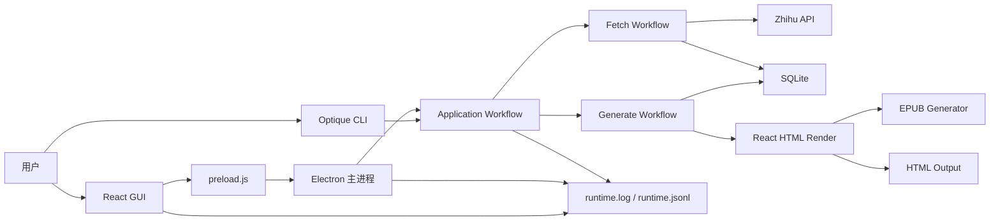

# 架构总览

## 项目定位

知乎助手是一个本地 Electron 桌面应用，同时保留 CLI 能力。核心链路是：

```text
任务配置 -> 抓取知乎数据 -> 写入 SQLite -> 读取数据库 -> 生成 HTML/EPUB
```

## 总体架构



## 目录职责

| 路径                               | 职责                                      |
| ---------------------------------- | ----------------------------------------- |
| `client/src`                       | React + Vite 前端                         |
| `src/index.ts`                     | Electron 主进程、窗口、IPC、任务启动      |
| `src/preload.js`                   | 向前端暴露 `window.electronAPI`           |
| `src/interface/cli`                | Optique CLI 入口和命令派发                |
| `src/application/workflow`         | 初始化、抓取、生成、完整运行编排          |
| `src/api/single`                   | 单个知乎接口请求封装                      |
| `src/api/batch`                    | 批量抓取、分页和入库编排                  |
| `src/model`                        | SQLite 数据模型和摘要读取                 |
| `src/library`                      | HTTP、EPUB、日志、工具函数、知乎签名      |
| `src/infrastructure/sqlite/schema` | SQLite 初始化 SQL                         |
| `src/public`                       | Electron 运行资源、CSS、封面、js-rpc 页面 |
| `doc/用户文档`                     | 面向使用者的说明                          |
| `doc/开发文档`                     | 面向维护者的说明                          |
| `doc/项目文档`                     | 历史规划和阶段性设计文档                  |

## 当前 UI 模块

`client/src/page/home` 是 GUI 主入口。

| 页面     | 组件                      | 说明                                   |
| -------- | ------------------------- | -------------------------------------- |
| 任务管理 | `component/customer_task` | 登录状态、链接识别、任务配置、启动任务 |
| 运行日志 | `component/log`           | 阶段状态、原始日志、输出历史、诊断导出 |
| 数据浏览 | `component/db_explorer`   | 数据库摘要、分页列表、摘要和详情浏览   |
| 登录     | `component/login`         | 内置 webview 登录知乎                  |
| 调试面板 | `component/debug`         | IPC 调试，默认由开发者模式隐藏         |

## 当前后端模块

| 模块     | 文件                                                     | 说明                                     |
| -------- | -------------------------------------------------------- | ---------------------------------------- |
| 运行入口 | `src/application/workflow/run_task/run_task_workflow.ts` | 创建运行上下文，串联 init/fetch/generate |
| 初始化   | `src/application/workflow/init/init_workflow.ts`         | 创建目录、建表、可选重建数据库           |
| 抓取     | `src/application/workflow/fetch/customer.ts`             | 合并任务、选择 batch fetcher             |
| 生成     | `src/application/workflow/generate/customer.ts`          | 从 DB 组装内容、排序、分卷、输出         |
| 日志     | `src/library/logger.ts`                                  | 同时写文本日志和 JSONL 结构化日志        |
| 路径     | `src/config/path.ts`                                     | 根路径、缓存目录、输出目录、日志路径     |

## 当前技术栈

| 层     | 技术                                       |
| ------ | ------------------------------------------ |
| 桌面壳 | Electron                                   |
| 前端   | React 18、Vite、Ant Design、Valtio、ahooks |
| CLI    | Optique                                    |
| 编译   | Babel + TypeScript                         |
| 网络   | axios                                      |
| 数据库 | SQLite + knex                              |
| 生成   | React SSR 模板、HTML、EPUB、sharp          |

