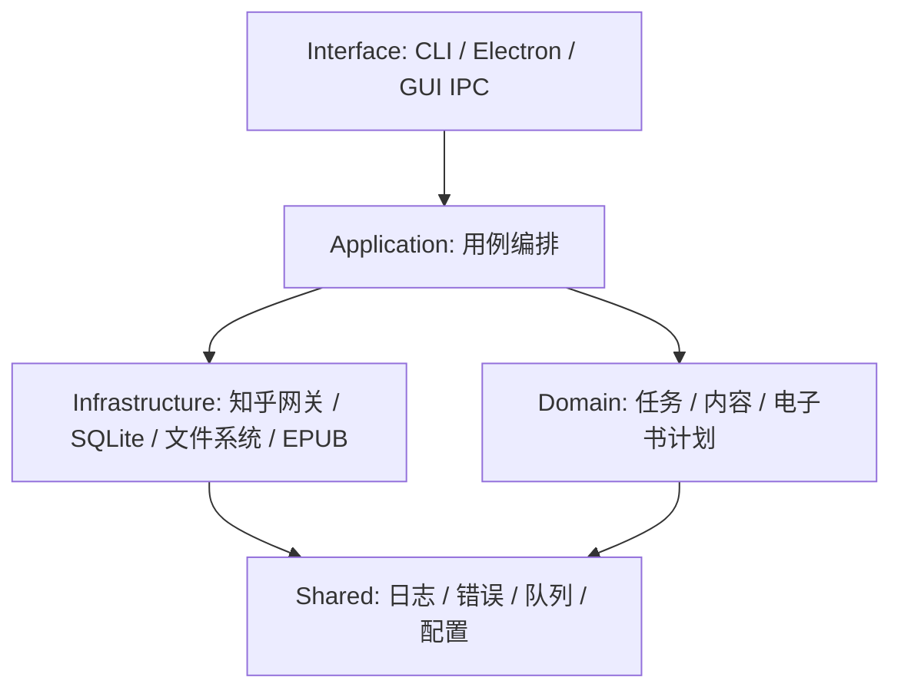
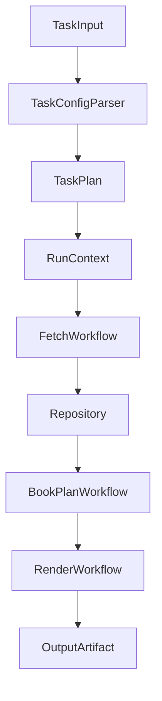

# 架构规范化改造方案

本文是下一轮代码改造的执行说明书。目标是在新会话中，Codex 可以直接按本文启动，不需要重新讨论改造范围。

关联文档：

1.  [项目架构与工作流.md](项目架构与工作流.md)：当前真实架构和完整工作流。
2.  [开发调试指南.md](开发调试指南.md)：环境、命令和调试方式。
3.  [系统设计思路.md](系统设计思路.md)：设计文档入口。
4.  [task/问题描述-2/问题2.md](task/问题描述-2/问题2.md)：本轮任务背景和确认记录。

## 已确认决策

下一轮代码改造按以下决策执行：

| 决策项         | 结论                                                                 |
| -------------- | -------------------------------------------------------------------- |
| 是否实际改代码 | 改。下一轮进入代码层面的全链路规范化改造                             |
| 改造范围       | 全链路：CLI、任务配置、抓取、入库、生成、日志、类型、注释、文档      |
| 优先级         | 优先保障命令行入口，GUI 后续适配                                     |
| 兼容性         | 不需要兼容旧命令、旧目录结构、旧 `config.json` schema 或旧数据库结构 |
| 目录结构       | 接受本文中的目标目录结构，可按工程美感微调                           |
| 命令行         | 可以根据新架构重新设计命令和使用方式                                 |
| `config.json`  | 接受 schema 调整                                                     |
| SQLite         | 允许重建数据库和修改表结构                                           |
| 知乎接口       | 不改知乎接口响应值结构，不改签名算法                                 |
| 数据类型来源   | 可基于现有 SQLite 样例数据和 `src/type` 反推完善类型                 |
| 测试           | 本次改造不强制新增自动化测试，改造后先做手工验证                     |
| 目标           | 借这次改造把项目推进为清晰、优雅、易维护的工程                       |

## 改造目标

知乎助手的业务链路非常清晰：

```text
任务配置 -> 抓取知乎数据 -> 写入本地数据库 -> 聚合排序分卷 -> 生成 HTML/EPUB
```

本次改造的目标不是做功能扩张，而是把这条链路拆成稳定、清晰、可维护的工程结构：

1.  功能分类清晰，目录能直接反映业务流程。
2.  每层职责单一，避免抓取、入库、生成互相套用。
3.  类型标注完善，所有方法都有明确参数和返回值类型。
4.  公开方法有有效注释，说明用途、副作用和失败语义。
5.  日志结构化，能定位一次运行中的阶段、任务和实体。
6.  CLI 入口先形成新架构闭环，再适配 GUI。
7.  改造后文档同步更新，新人可以按文档上手。

## 不变量

以下内容改造时需要保持稳定：

1.  知乎接口 URL、请求参数、响应字段含义不主动改动。
2.  知乎签名算法和 `x-zse-96` 生成逻辑不主动改动。
3.  当前支持的任务类型不删减。
4.  最终仍输出 HTML 和 EPUB。
5.  仍以本地 SQLite 作为默认持久化方案。
6.  仍支持图片质量配置、排序配置和自动分卷。

可以改变：

1.  目录结构。
2.  CLI 命令名称和参数。
3.  `config.json` schema。
4.  SQLite 表结构。
5.  日志格式。
6.  GUI 与主进程通信方式。

## 当前问题

### 抓取层边界不清

`src/api/batch` 当前同时承担：

1.  分页抓取。
2.  添加任务到全局任务池。
3.  调用 Model 入库。
4.  继续调用其他 batch 抓详情。

例如收藏夹抓取会先写收藏夹信息和收藏记录，再实例化回答、想法、文章 batch 抓详情。这个设计能跑通，但 batch 已经变成半个业务编排层。

改造方向：

1.  知乎请求放到 gateway。
2.  入库放到 repository。
3.  子任务扩展放到 workflow。
4.  batch 概念改为 fetch job，不再互相 new。

### 数据层过度依赖 raw_json

当前表大多保存知乎原始 `raw_json`。这对快速兼容接口变化很有价值，但模型层和生成层边界不清。

改造方向：

1.  保留必要的 raw payload，便于追溯。
2.  同时提取常用查询字段，提升可读性和生成效率。
3.  用 mapper 把知乎响应转换为持久化 DTO。
4.  repository 不直接泄漏知乎原始响应给上层。

### 生成层职责过重

当前生成链路中的几个文件承担太多职责：

| 当前文件                                           | 当前问题                                                                     |
| -------------------------------------------------- | ---------------------------------------------------------------------------- |
| `src/application/workflow/generate/customer.ts`                 | 读取配置、查库、组装、排序、分卷、调用输出全部混在一起                       |
| `src/application/workflow/generate/resource/library/package.ts` | 同时是领域模型、排序工具、分卷辅助                                           |
| `src/application/workflow/generate/library/epub_generator.ts`   | 同时负责 HTML 清洗、图片替换、图片下载、Latex 转换、静态资源、EPUB、输出复制 |

改造方向：

1.  建立 `BookPlan` 领域模型。
2.  排序、分卷、渲染、图片、EPUB 打包分开。
3.  生成 workflow 只编排步骤，不处理底层文件细节。

### Electron 主进程过宽

`src/index.ts` 曾同时处理窗口、cookie、IPC、配置、旧命令调度、日志裁剪等；本轮已将命令行入口迁移为 Optique CLI，并让 Electron 调用 application workflow。

改造方向：

1.  Electron 只做桌面壳和 IPC 入口。
2.  业务流程下沉到 application workflow。
3.  GUI 和 CLI 共用同一套 workflow。
4.  下一轮优先 CLI，GUI 可以后续再接新接口。

### 配置、常量和类型重复

根项目和前端各有一套任务常量和类型，容易漂移。

改造方向：

1.  建立单一任务配置 schema。
2.  根项目和前端共享生成出来的类型或共享源码包。
3.  CLI、GUI、文档都以同一份 schema 为准。

### 全局状态隐式传播

当前全局状态包括：

1.  `RequestConfig.ua` / `RequestConfig.cookie`。
2.  `CommonUtil.taskManager`。
3.  `PathConfig` 静态路径。
4.  `runtime.log` 共享日志文件。

改造方向：

1.  引入 `RunContext`。
2.  每次任务运行都有独立 `runId`。
3.  请求配置、路径、logger、queue 都从 context 传递。
4.  不在 application/domain 层读取隐式全局状态。

### 日志可读但不可分析

当前日志是纯文本，GUI 可以展示，但无法按任务、阶段、实体过滤。

改造方向：

1.  保留人类可读 `runtime.log`。
2.  增加结构化 `runtime.jsonl`。
3.  每条关键日志携带 `runId`、阶段、任务类型、实体类型、实体 id、耗时和错误码。

### 类型和注释不均匀

当前部分方法缺少明确返回类型，`any` 边界较多。

改造方向：

1.  所有方法必须有明确参数类型和返回值类型。
2.  所有 public 方法必须有 JSDoc。
3.  应用层和领域层禁止裸 `any`。
4.  可预期失败统一为 `Result<T, E>` 或统一错误类型。

## 目标架构

下一轮建议按“接口层 + 应用层 + 领域层 + 基础设施层 + 共享层”改造。



### 目标目录

可按以下目录执行。若实施时发现命名更优，可以小幅调整，但需要保持层级职责不变。

```text
src/
  interface/
    cli/
      command/
      parser/
    electron/
      main/
      window/
    ipc/
      handler/
      contract/
  application/
    workflow/
      init/
      fetch/
      generate/
      run_task/
    usecase/
  domain/
    task/
    content/
    book/
    output/
  infrastructure/
    zhihu/
      gateway/
      mapper/
      sign/
    sqlite/
      repository/
      migration/
      schema/
    render/
      html/
      epub/
    filesystem/
  shared/
    config/
    logger/
    queue/
    error/
    result/
    type/
client/
  src/
    page/
    shared/
    api/
```

### 层级职责

| 层             | 职责                                                      | 不应该做                        |
| -------------- | --------------------------------------------------------- | ------------------------------- |
| interface      | 接收 CLI/IPC 输入，解析参数，调用应用层                   | 直接抓知乎、直接写数据库        |
| application    | 编排完整用例，例如初始化、抓取、生成、运行任务            | 关心 axios、knex、Electron 细节 |
| domain         | 定义任务、内容、排序、分卷、书籍计划等稳定概念            | 读写文件、请求网络              |
| infrastructure | 实现知乎请求、SQLite repository、HTML/EPUB 输出、文件系统 | 夹带业务决策                    |
| shared         | 日志、错误、队列、配置、公共类型                          | 承载具体业务流程                |

## 目标工作流

### 新 CLI 优先闭环

下一轮优先保证命令行入口。推荐先实现以下闭环：

```text
init -> fetch -> persist -> generate -> output
```

建议命令可以重新设计，例如：

```shell
pnpm zhihuhelp init
pnpm zhihuhelp run --config config.json
pnpm zhihuhelp fetch --config config.json
pnpm zhihuhelp generate --config config.json
```

命令名称不是强约束，可以按实现美感调整。关键是新命令必须直接进入 application workflow，而不是复用旧的宽职责命令。

### 执行任务流程



目标概念：

| 概念             | 说明                                                          |
| ---------------- | ------------------------------------------------------------- |
| `TaskInput`      | CLI 或 GUI 的原始输入                                         |
| `TaskConfig`     | 已校验、可执行的任务配置                                      |
| `TaskPlan`       | 按任务类型归并后的抓取计划                                    |
| `RunContext`     | 一次运行的上下文，包含 `runId`、请求配置、路径、logger、queue |
| `FetchWorkflow`  | 全链路抓取编排                                                |
| `Repository`     | 统一内容读写接口                                              |
| `BookPlan`       | 生成前的领域结构，包含卷、单元、页面                          |
| `RenderWorkflow` | HTML、图片、EPUB 输出编排                                     |
| `OutputArtifact` | 最终输出结果，包含 HTML/EPUB 路径和运行摘要                   |

## 数据模型与 SQLite

### 数据来源

允许使用两种来源完善数据类型：

1.  现有 SQLite 样例数据中的 `raw_json`。
2.  `src/type` 目录下已有的知乎类型定义。

建议流程：

1.  先从 `src/type` 建立初版领域类型。
2.  再读取 SQLite 样例数据，对照真实字段修正类型。
3.  对外部知乎响应和内部领域对象做分层命名。

### 类型分层

建议区分以下类型：

| 类型层        | 示例             | 说明                               |
| ------------- | ---------------- | ---------------------------------- |
| Zhihu DTO     | `ZhihuAnswerDto` | 知乎接口原始响应结构，不主动改字段 |
| Persist DTO   | `AnswerRow`      | SQLite 表行结构                    |
| Domain Entity | `AnswerContent`  | 业务内部使用的稳定结构             |
| View Model    | `BookPageView`   | HTML/EPUB 渲染需要的数据           |

### 表结构方向

允许修改表结构和重建数据库。建议新表结构同时满足：

1.  常用字段可直接查询。
2.  原始响应可追溯。
3.  集合关系清晰。
4.  生成阶段不需要反复理解知乎原始 JSON。

建议表方向：

| 表                         | 说明                    |
| -------------------------- | ----------------------- |
| `content_answer`           | 回答核心字段和原始 JSON |
| `content_article`          | 文章核心字段和原始 JSON |
| `content_pin`              | 想法核心字段和原始 JSON |
| `author`                   | 作者信息                |
| `container_collection`     | 收藏夹信息              |
| `container_column`         | 专栏信息                |
| `container_topic`          | 话题信息                |
| `relation_collection_item` | 收藏夹到内容的关系      |
| `relation_topic_answer`    | 话题到回答的关系        |
| `relation_author_activity` | 用户行为和内容的关系    |
| `run_record`               | 一次任务运行记录，可选  |

实际表名可调整，但要统一命名风格。

## 抓取层改造

### 目标拆分

| 当前模块                 | 目标模块                           | 说明                       |
| ------------------------ | ---------------------------------- | -------------------------- |
| `api/single`             | `infrastructure/zhihu/gateway`     | 只负责请求和响应转换       |
| `api/batch`              | `application/workflow/fetch`       | 只负责编排抓取计划         |
| `model`                  | `infrastructure/sqlite/repository` | 只负责持久化               |
| `CommonUtil.taskManager` | `shared/queue`                     | 统一并发、节流、超时、重试 |

### 目标流程

1.  `TaskPlanBuilder` 根据配置生成 `FetchJob[]`。
2.  `FetchWorkflow` 从队列取出 job。
3.  `ZhihuGateway` 请求知乎接口。
4.  `ZhihuMapper` 转换为领域对象和持久化 DTO。
5.  `Repository` 写入 SQLite。
6.  如果返回内容指向更多详情，workflow 生成新的 `FetchJob`。
7.  日志记录每个 job 的开始、成功、失败和耗时。

### 任务类型保留

下一轮要保留当前任务类型能力：

| 类型                    | 说明                 |
| ----------------------- | -------------------- |
| `author-answer`         | 用户的所有回答       |
| `author-ask-question`   | 用户提问过的所有问题 |
| `author-article`        | 用户发布的所有文章   |
| `author-pin`            | 用户发布的所有想法   |
| `author-agree-answer`   | 用户赞同过的所有回答 |
| `author-agree-article`  | 用户赞同过的所有文章 |
| `author-watch-question` | 用户关注过的所有问题 |
| `block-account-answer`  | 销号用户的所有回答   |
| `topic`                 | 话题                 |
| `collection`            | 收藏夹               |
| `column`                | 专栏                 |
| `article`               | 单篇文章             |
| `question`              | 单个问题             |
| `answer`                | 单个回答             |
| `pin`                   | 单条想法             |

## 生成层改造

### 目标拆分

| 当前模块            | 目标模块                     | 说明                                                    |
| ------------------- | ---------------------------- | ------------------------------------------------------- |
| `GenerateCustomer`  | `BookBuildUseCase`           | 生成用例入口                                            |
| `package.ts`        | `domain/book`                | Page、Unit、BookPlan 领域模型                           |
| `html_render`       | `infrastructure/render/html` | 只负责模板渲染                                          |
| `epub_generator.ts` | 多个服务                     | 拆成 HTML 清洗、图片资源、静态资源、EPUB 打包、输出复制 |

### 目标步骤

1.  `BookSourceLoader` 从 repository 读取内容。
2.  `BookPlanBuilder` 生成 Page、Unit、Volume。
3.  `BookSorter` 按排序规则处理内容。
4.  `BookSplitter` 按最大条数分卷。
5.  `HtmlRenderer` 渲染页面。
6.  `HtmlSanitizer` 清洗知乎 HTML。
7.  `AssetCollector` 提取图片和静态资源。
8.  `ImageCacheService` 下载、缓存和转换图片。
9.  `EpubPackager` 生成 EPUB。
10. `OutputPublisher` 复制到最终输出目录。

### 输出策略

仍需支持：

1.  独立输出电子书。
2.  合并输出，按任务拆分章节。
3.  合并输出，内容打乱重排。
4.  按最大条数自动分卷。
5.  图片质量：原图、高清、无图。
6.  HTML 输出。
7.  EPUB 输出。

## 日志规范

### 日志格式

下一轮建议同时写两种日志：

| 文件            | 格式         | 用途                 |
| --------------- | ------------ | -------------------- |
| `runtime.log`   | 人类可读文本 | GUI 展示和快速排查   |
| `runtime.jsonl` | JSON Lines   | 过滤、统计、运行摘要 |

### 日志上下文

每条关键日志携带：

| 字段         | 说明                                                       |
| ------------ | ---------------------------------------------------------- |
| `runId`      | 一次完整任务运行 id                                        |
| `stage`      | `init`、`fetch`、`persist`、`generate`、`render`、`output` |
| `taskType`   | 任务类型                                                   |
| `entityType` | `answer`、`article`、`pin`、`collection` 等                |
| `entityId`   | 当前实体 id                                                |
| `jobId`      | 队列任务 id                                                |
| `durationMs` | 耗时                                                       |
| `level`      | `debug`、`info`、`warn`、`error`                           |
| `errorCode`  | 错误编码，可选                                             |

### 日志等级

| 等级    | 用途                             |
| ------- | -------------------------------- |
| `debug` | 调试细节，默认可关闭             |
| `info`  | 正常进度                         |
| `warn`  | 可恢复问题，例如单张图片下载失败 |
| `error` | 当前任务失败                     |

## 类型与注释规范

下一轮代码改造必须遵守：

1.  所有方法显式声明参数类型。
2.  所有方法显式声明返回值类型。
3.  所有 public 方法写 JSDoc。
4.  JSDoc 说明用途、副作用、失败语义。
5.  应用层和领域层禁止裸 `any`。
6.  外部输入先解析为 DTO，再转换为领域类型。
7.  可预期失败使用统一 `Result<T, E>` 或统一错误类型。
8.  注释解释设计原因和边界条件，不重复代码字面含义。

## 实施阶段

### 阶段 0：实施前阅读

新会话启动后先阅读：

1.  本文。
2.  [项目架构与工作流.md](项目架构与工作流.md)。
3.  [开发调试指南.md](开发调试指南.md)。
4.  `package.json`、`pnpm-workspace.yaml`。
5.  `src/interface/cli/main.ts`、`src/index.ts`。
6.  `src/application/workflow/fetch/customer.ts`、`src/application/workflow/generate/customer.ts`。
7.  `src/api/batch/base.ts`、`src/library/http/index.ts`。
8.  `src/model/base.ts`、`src/command/init.sql`。

然后先确认工作区是否有用户未提交修改，不要覆盖用户改动。

### 阶段 1：建立新架构骨架

产出：

1.  目标目录结构。
2.  `RunContext`。
3.  新 logger。
4.  新 queue。
5.  新 config parser。
6.  新 CLI 入口。

验收：

1.  新 CLI 能启动并打印版本或帮助。
2.  新 logger 能写 `runtime.log` 和 `runtime.jsonl`。
3.  旧代码可以暂时存在，但新入口不应继续扩大旧架构。

### 阶段 2：定义任务配置与领域类型

产出：

1.  `TaskConfig` schema。
2.  `TaskType`、`ContentType`、`GenerateMode`。
3.  `FetchJob`、`FetchJobResult`。
4.  `BookPlan`、`BookUnit`、`BookPage`、`BookVolume`。
5.  知乎 DTO、持久化 DTO、领域实体分层。

验收：

1.  前后端不再维护两套任务类型。
2.  CLI 能校验新配置。
3.  类型命名清晰，避免直接把知乎响应当领域模型到处传。

### 阶段 3：重建 SQLite 与 repository

产出：

1.  新 migration/schema。
2.  repository 接口和实现。
3.  mapper。
4.  基于样例数据和 `src/type` 的类型修正。

验收：

1.  `init` 能重建数据库。
2.  repository 不请求网络。
3.  repository 方法都有明确类型和注释。

### 阶段 4：重建抓取 workflow

产出：

1.  `ZhihuGateway` 系列接口。
2.  `FetchWorkflow`。
3.  子任务扩展机制。
4.  限流、超时、错误和日志上下文。

验收：

1.  gateway 不写数据库。
2.  workflow 不关心 axios 细节。
3.  至少打通单问题、单回答、收藏夹中的一种复杂任务。

### 阶段 5：重建生成 workflow

产出：

1.  `BookSourceLoader`。
2.  `BookPlanBuilder`。
3.  `BookSorter`。
4.  `BookSplitter`。
5.  `HtmlRenderer`。
6.  `ImageCacheService`。
7.  `EpubPackager`。
8.  `OutputPublisher`。

验收：

1.  能从新 repository 读取内容生成 HTML。
2.  能输出 EPUB。
3.  排序、分卷、图片质量配置可用。

### 阶段 6：迁移 CLI 完整闭环

产出：

1.  新 `init` 命令。
2.  新 `fetch` 命令。
3.  新 `generate` 命令。
4.  新 `run` 命令。
5.  新配置示例。

验收：

1.  `run` 能执行初始化、抓取、生成完整链路。
2.  日志能定位每个阶段。
3.  输出目录中有 HTML 和 EPUB。

### 阶段 7：GUI 后续适配

GUI 不是下一轮第一优先级，但代码改造时要为 GUI 留出接口。

产出：

1.  IPC contract。
2.  GUI 调用 application workflow 的薄适配。
3.  日志读取接口。
4.  配置读取和保存接口。

验收：

1.  GUI 能加载新配置。
2.  GUI 能启动新 run workflow。
3.  GUI 日志页能读取新文本日志。

### 阶段 8：清理旧代码和文档

产出：

1.  删除或隔离旧 batch 互相调用模式。
2.  删除重复常量和类型。
3.  更新开发调试指南。
4.  更新架构文档。
5.  更新 demo 配置。

验收：

1.  新人能按文档理解入口、流程和目录。
2.  项目中没有明显的旧命令/旧 schema 误导。

## 手工验证场景

代码改造后至少手工验证：

1.  初始化数据库。
2.  单回答抓取与生成。
3.  单问题抓取与生成。
4.  收藏夹混合回答、文章、想法抓取与生成。
5.  图片质量：原图、高清、无图。
6.  自动分卷。
7.  日志中断后能定位失败阶段。
8.  输出目录包含 HTML 和 EPUB。
9.  CLI 帮助信息能说明新命令用法。
10. GUI 后续适配时，登录、启动任务、查看日志、打开输出目录可用。

## 新会话启动提示

在新会话中可以直接这样要求：

```text
请阅读 D:\win_www\zhihuhelp\doc\架构规范化改造方案.md，
并按文档执行下一轮代码改造。优先保障命令行入口，
允许调整目录、命令、config schema 和 SQLite 表结构，
不需要兼容旧入口，不改知乎接口响应结构和签名算法。
```

新会话执行时应先给出阶段计划，然后从“阶段 0：实施前阅读”开始。
