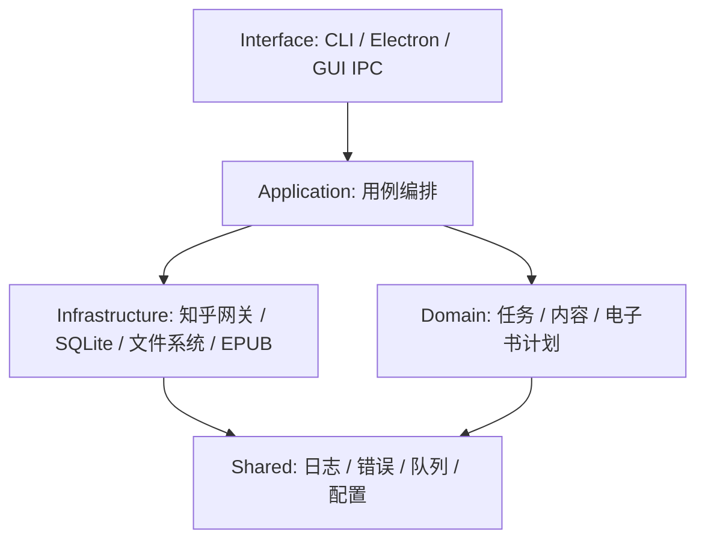
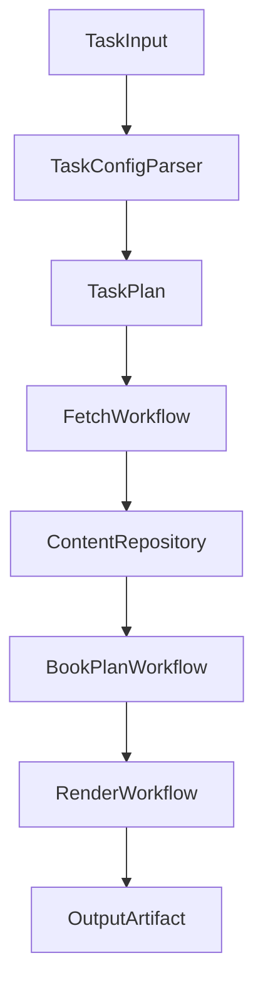

# 架构规范化改造方案

本文基于 [项目架构与工作流.md](项目架构与工作流.md) 中的现状梳理，输出当前问题清单和下一轮代码改造方案。本轮只给方案，不实际修改代码架构。

## 本轮结论

项目的业务场景很清晰：任务配置 -> 抓取知乎数据 -> 写入本地数据库 -> 聚合排序分卷 -> 生成 HTML/EPUB。当前代码的问题不在业务复杂，而在职责边界长期叠加后变得松散：

1.  抓取、入库、任务编排互相穿插。
2.  生成层同时承担领域模型、排序、渲染、图片处理、文件输出。
3.  Electron 主进程同时承担窗口、cookie、IPC、命令调度和日志读取。
4.  根项目和前端存在重复的任务常量与类型。
5.  日志是纯文本串联，缺少结构化上下文。
6.  类型标注和注释覆盖不均匀，很多边界依赖调用者理解历史约定。

下一轮建议做一次全链路规范化，允许调整目录结构、模块边界和命令兼容性，以工程美感和长期维护为优先。

## 当前问题清单

### 1. 抓取层边界不清

`src/api/batch` 当前同时做四件事：

1.  分页抓取。
2.  添加任务到全局任务池。
3.  调用 Model 入库。
4.  继续调用其他 batch 抓取详情。

例如收藏夹抓取会先写入收藏夹信息和收藏记录，再实例化回答、想法、文章三个 batch 继续抓详情。这个做法能跑通，但 batch 已经不只是 API 层，而是半个业务编排层。

影响：

1.  难以复用单个抓取能力。
2.  难以统一错误处理和重试策略。
3.  新增任务类型时容易复制旧模式。
4.  抓取与入库绑定，无法方便支持“只抓不存”或“抓取后做预处理”。

### 2. 数据层过度依赖 raw_json

当前数据库以 `raw_json` 保存知乎原始响应。这个策略对古老项目很实用，但目前模型层往往只是 JSON 序列化和反序列化，没有形成清晰的领域数据边界。

影响：

1.  表结构和业务类型之间缺少显式映射。
2.  生成层需要理解知乎原始响应字段。
3.  类型错误通常要到运行时才暴露。
4.  数据迁移和版本升级缺少明确策略。

### 3. 生成层职责过重

`src/command/generate/customer.ts` 负责读取配置、查询数据库、组织 Unit/Page、排序、分卷和调用生成器。`src/command/generate/resource/library/package.ts` 同时是领域模型和排序工具。`src/command/generate/library/epub_generator.ts` 同时负责 HTML 清洗、图片路径替换、图片下载、Latex 图片转换、静态资源复制、EPUB 打包和输出复制。

影响：

1.  修改输出规则时容易影响图片或文件系统逻辑。
2.  Page/Unit/Book 概念还不够稳定，难以单独验证。
3.  HTML 输出和 EPUB 输出共享过程不够显式。
4.  图片处理失败、EPUB 生成失败、文件复制失败缺少统一错误模型。

### 4. Electron 主进程过宽

`src/index.ts` 同时处理：

1.  创建主窗口和 js-rpc 窗口。
2.  加载前端。
3.  管理知乎 cookie。
4.  暴露 IPC。
5.  读写配置。
6.  直接调 Ace 命令。
7.  读取和裁剪日志。

影响：

1.  GUI 调度逻辑难以在命令行中复用。
2.  IPC 参数缺少统一类型和校验。
3.  Electron 专属逻辑和业务用例混在一起。

### 5. 配置、常量和类型重复

根项目有 `src/constant/task_config.ts` 和 `src/type/task_config.d.ts`，前端也有 `client/src/resource/const/task_config.ts` 和 `client/src/resource/type/task_config.d.ts`。两端概念基本一致，但没有单一来源。

影响：

1.  新增任务类型时需要手工同步两边。
2.  前端表单类型和后端运行类型可能漂移。
3.  文档、GUI、命令行可能出现不同表述。

### 6. 全局状态隐式传播

当前全局状态包括：

1.  `RequestConfig.ua` / `RequestConfig.cookie`。
2.  `CommonUtil.taskManager`。
3.  `PathConfig` 静态路径。
4.  `runtime.log` 共享日志文件。

这些状态降低了早期开发成本，但隐藏了调用依赖。

影响：

1.  很难并行执行多个任务。
2.  很难隔离一次运行的上下文。
3.  很难给日志、请求、任务队列统一添加 runId。

### 7. 日志可读但不可分析

日志目前是时间戳 + 文本内容。GUI 能展示，但无法按任务、阶段、实体或错误类型过滤。

影响：

1.  长任务失败时定位成本高。
2.  无法生成运行摘要。
3.  无法区分用户可读错误和开发者调试信息。

### 8. 类型和注释不均匀

部分核心方法已有类型和注释，但仍存在：

1.  `any` 边界较多。
2.  参数和返回值没有形成统一 Result 类型。
3.  部分注释描述旧行为。
4.  public 方法的副作用不总是明确。

下一轮验收边界应覆盖全部方法：所有方法都要有明确参数类型、返回类型；公开方法要说明用途、副作用和失败语义。

## 目标架构

建议下一轮改造成“接口层 + 应用层 + 领域层 + 基础设施层”的结构。



### 建议目录

```text
src/
  interface/
    cli/
    electron/
    ipc/
  application/
    workflow/
    usecase/
  domain/
    task/
    content/
    book/
    output/
  infrastructure/
    zhihu/
      gateway/
      mapper/
    sqlite/
      repository/
      migration/
    render/
      html/
      epub/
    filesystem/
  shared/
    config/
    logger/
    queue/
    error/
    type/
client/
  src/
    page/
    shared/
    api/
```

### 层级职责

| 层             | 职责                                                      | 不应该做                        |
| -------------- | --------------------------------------------------------- | ------------------------------- |
| interface      | 接收 CLI/IPC 输入，做参数校验，调用应用层                 | 直接抓知乎、直接写数据库        |
| application    | 编排完整用例，例如执行任务、抓取集合、生成电子书          | 关心 axios、knex、Electron 细节 |
| domain         | 定义任务、内容、排序、分卷、书籍计划等稳定概念            | 读写文件、请求网络              |
| infrastructure | 实现知乎请求、SQLite repository、HTML/EPUB 输出、文件系统 | 夹带业务决策                    |
| shared         | 日志、错误、队列、配置、公共类型                          | 承载具体业务流程                |

## 目标工作流

### 执行任务



目标概念：

| 概念                | 说明                                        |
| ------------------- | ------------------------------------------- |
| `TaskInput`         | GUI 或 CLI 的原始输入                       |
| `TaskConfig`        | 已校验的任务配置                            |
| `TaskPlan`          | 按任务类型归并后的抓取计划                  |
| `FetchWorkflow`     | 全链路抓取编排                              |
| `ContentRepository` | 统一内容读写接口                            |
| `BookPlan`          | 生成前的领域结构，包含卷、单元、页面        |
| `RenderWorkflow`    | HTML、图片、EPUB 输出编排                   |
| `OutputArtifact`    | 最终输出结果，包含 HTML/EPUB 路径和运行摘要 |

### 抓取工作流

目标拆分：

| 当前模块                 | 目标模块                           | 说明                       |
| ------------------------ | ---------------------------------- | -------------------------- |
| `api/single`             | `infrastructure/zhihu/gateway`     | 只负责请求和响应转换       |
| `api/batch`              | `application/workflow/fetch`       | 只负责编排抓取计划         |
| `model`                  | `infrastructure/sqlite/repository` | 只负责持久化               |
| `CommonUtil.taskManager` | `shared/queue`                     | 统一并发、节流、超时、重试 |

目标流程：

1.  应用层根据任务类型创建 `FetchJob`。
2.  `FetchWorkflow` 调用对应 `ZhihuGateway` 获取数据。
3.  `Mapper` 把知乎原始响应转换为领域实体或持久化 DTO。
4.  `Repository` 写入 SQLite。
5.  若需要抓取详情，返回新的 `FetchJob`，由 workflow 统一调度。

这样可以避免 batch 类互相 new，也能让重试、限流、日志上下文集中处理。

### 生成工作流

目标拆分：

| 当前模块            | 目标模块                     | 说明                                                    |
| ------------------- | ---------------------------- | ------------------------------------------------------- |
| `GenerateCustomer`  | `BookBuildUseCase`           | 生成用例入口                                            |
| `package.ts`        | `domain/book`                | Page、Unit、BookPlan 领域模型                           |
| `html_render`       | `infrastructure/render/html` | 只负责模板渲染                                          |
| `epub_generator.ts` | 多个服务                     | 拆成 HTML 清洗、图片资源、静态资源、EPUB 打包、输出复制 |

建议拆分后的生成步骤：

1.  `BookSourceLoader` 从 repository 读取内容。
2.  `BookPlanBuilder` 生成 Page/Unit/Volume。
3.  `BookSorter` 按排序规则处理内容。
4.  `BookSplitter` 按最大条数分卷。
5.  `HtmlRenderer` 渲染页面。
6.  `AssetCollector` 提取图片和静态资源。
7.  `ImageCacheService` 下载、缓存和转换图片。
8.  `EpubPackager` 生成 EPUB。
9.  `OutputPublisher` 复制到最终输出目录。

## 日志规范

建议把日志改为结构化事件，同时继续输出人类可读文本。

### 日志上下文

每次执行任务生成一个 `runId`，所有日志都携带：

| 字段         | 说明                                                       |
| ------------ | ---------------------------------------------------------- |
| `runId`      | 一次完整任务运行 id                                        |
| `stage`      | `init`、`fetch`、`persist`、`generate`、`render`、`output` |
| `taskType`   | 任务类型                                                   |
| `entityType` | `answer`、`article`、`pin`、`collection` 等                |
| `entityId`   | 当前实体 id                                                |
| `jobId`      | 队列任务 id                                                |
| `durationMs` | 可选，耗时                                                 |
| `errorCode`  | 可选，错误编码                                             |

### 日志等级

| 等级    | 用途                             |
| ------- | -------------------------------- |
| `debug` | 调试细节，默认可关闭             |
| `info`  | 正常进度                         |
| `warn`  | 可恢复问题，例如单张图片下载失败 |
| `error` | 当前任务失败                     |

### 日志落地

1.  `runtime.log` 保留文本格式，方便 GUI 展示。
2.  新增 `runtime.jsonl` 保存结构化日志，方便过滤和摘要。
3.  GUI 日志页后续按 `runId`、阶段、等级过滤。

## 类型与注释规范

下一轮代码改造时建议执行以下规则：

1.  所有方法必须显式声明参数和返回值类型。
2.  所有 public 方法必须有 JSDoc，说明用途、副作用和失败语义。
3.  禁止在应用层和领域层使用裸 `any`。
4.  外部输入先解析为 DTO，再转换为领域类型。
5.  用 `Result<T, E>` 或统一异常类型表达可预期失败。
6.  注释描述“为什么这样做”和边界条件，不重复代码本身。
7.  文件命名保持一致；如果继续使用下划线命名，需要全项目统一。

## 改造阶段

### 阶段 1：定义目标类型与上下文

产出：

1.  `RunContext`：包含 `runId`、路径、请求配置、logger、queue。
2.  `TaskConfig` 单一来源。
3.  `TaskType`、`ContentType`、`GenerateMode` 等领域枚举。
4.  共享前后端的任务配置 schema。

验收：

1.  前端和后端不再维护两套任务类型。
2.  所有入口都通过同一个配置解析器。

### 阶段 2：拆出应用层工作流

产出：

1.  `RunTaskWorkflow`。
2.  `InitWorkflow`。
3.  `FetchWorkflow`。
4.  `GenerateWorkflow`。

验收：

1.  Electron 和 CLI 都只调用 workflow。
2.  Electron 主进程不再直接处理业务步骤。

### 阶段 3：重建抓取层边界

产出：

1.  `ZhihuGateway` 系列接口。
2.  `FetchJob` 和 `FetchJobResult`。
3.  `Repository` 系列接口。
4.  `Mapper` 系列转换器。

验收：

1.  gateway 不写数据库。
2.  repository 不请求网络。
3.  workflow 统一处理子任务扩展。

### 阶段 4：重建生成层边界

产出：

1.  `BookPlan` 领域模型。
2.  `BookPlanBuilder`、`BookSorter`、`BookSplitter`。
3.  `HtmlRenderer`、`ImageCacheService`、`EpubPackager`、`OutputPublisher`。

验收：

1.  排序和分卷不依赖文件系统。
2.  图片处理不关心数据库。
3.  EPUB 打包不关心知乎原始响应。

### 阶段 5：规范日志和错误

产出：

1.  结构化 logger。
2.  `AppError` / `ErrorCode`。
3.  队列任务状态事件。
4.  GUI 日志过滤所需接口。

验收：

1.  每个任务有完整开始、成功、失败日志。
2.  关键日志都带 `runId` 和阶段。
3.  用户可读错误与开发者堆栈分离。

### 阶段 6：清理旧代码和文档

产出：

1.  删除旧 batch 互相调用模式。
2.  删除重复类型和常量。
3.  更新开发调试文档、架构文档和迁移说明。

验收：

1.  新人能按文档理解入口、流程和目录。
2.  代码目录能直接反映业务流程。

## 建议的手工验证场景

本次确认中暂不要求新增测试。代码改造后至少建议手工验证：

1.  初始化数据库：`pnpm ace Init:Env --rebase`。
2.  单问题抓取与生成。
3.  单回答抓取与生成。
4.  收藏夹混合回答/文章/想法抓取与生成。
5.  GUI 登录、启动任务、查看日志、打开输出目录。
6.  图片质量为原图、高清、无图时的输出。
7.  自动分卷。
8.  日志中断后能定位失败阶段。

## 风险

1.  知乎接口和签名逻辑可能变化，抓取层改造时要避免同时大幅改签名算法。
2.  SQLite 中已有 `raw_json` 数据，若修改表结构，需要明确迁移或重建策略。
3.  Electron、sqlite3、sharp 都涉及原生依赖，打包流程应单独验证。
4.  允许不兼容旧命令和目录后，文档必须同步，否则使用体验会断裂。

## 下一轮建议启动条件

建议下一轮代码改造开始前，先确认：

1.  是否接受目标目录结构。
2.  是否接受 `config.json` schema 调整。
3.  是否允许重建 SQLite 数据库。
4.  是否优先保证 GUI 入口，还是优先保证命令行入口。
5.  是否在改造过程中保留旧入口一段时间作为过渡。
