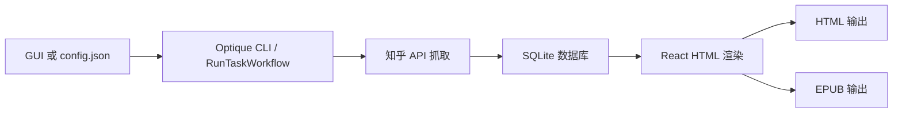

# 开发调试指南

这份文档面向第一次接手项目的开发者。阅读顺序建议是：先完成环境安装，再跑通命令行流程，最后按需调试 GUI 和打包。

架构和工作流说明见 [项目架构与工作流.md](项目架构与工作流.md)，下一轮架构规范化方案见 [架构规范化改造方案.md](架构规范化改造方案.md)。

## 环境要求

1.  Node.js 使用 24.x。仓库根目录提供了 `.node-version` 和 `.nvmrc`，可被常见 Node 版本管理工具识别。
2.  包管理器使用 pnpm 11.x。根目录和 `client` 的 `package.json` 都声明了 `packageManager: pnpm@11.5.0`，CI 也会安装同一版本。
3.  Windows GUI/打包环境建议安装 Visual Studio 2022 C++ 构建工具和 Python 3，用于 `sqlite3`、`sharp` 等原生依赖在必要时重建。
4.  Electron GUI 需要可视化桌面环境；纯命令行抓取和生成可以只跑 Optique CLI。

## 初次安装

```shell
npm install --global pnpm@11.5.0
pnpm install
```

本项目是 pnpm workspace，根目录管理两个项目：

| 路径     | 职责                                                                 |
| -------- | -------------------------------------------------------------------- |
| `.`      | Electron 主进程、Optique CLI、知乎接口、SQLite 数据模型、EPUB/HTML 生成 |
| `client` | Vite + React + Ant Design 前端界面                                   |

因此在根目录执行一次 `pnpm install` 会同时安装根项目和 `client` 的依赖。不要再单独维护 `client/pnpm-lock.yaml`。

pnpm 11 会拦截依赖安装脚本。项目已经在 `pnpm-workspace.yaml` 中批准 `core-js`、`electron`、`esbuild`、`lzma-native`、`sharp`、`sqlite3` 的构建脚本，覆盖当前项目需要的前端构建、Electron 下载和原生依赖安装。

## 常用命令

| 命令                         | 说明                                                  |
| ---------------------------- | ----------------------------------------------------- |
| `pnpm build`                 | 将 `src` 中的 TS/JS 编译到 `dist`，保留 sourcemap     |
| `pnpm watch`                 | 监听 `src`，持续编译到 `dist`                         |
| `pnpm zhihuhelp --help`      | 查看新 CLI 命令说明                                   |
| `pnpm zhihuhelp init --config config.json` | 初始化目录和 SQLite 表结构                 |
| `pnpm zhihuhelp fetch --config config.json` | 按 `config.json` 抓取知乎数据并写入数据库  |
| `pnpm zhihuhelp generate --config config.json` | 按 `config.json` 从数据库生成 HTML/EPUB |
| `pnpm zhihuhelp run --config config.json` | 执行初始化、抓取和生成完整链路              |
| `pnpm startgui`              | 启动 `client` Vite 开发服务，端口为 8080              |
| `pnpm start`                 | 以调试模式启动 Electron，加载 `http://localhost:8080` |
| `pnpm buildgui`              | 构建前端并复制到 `dist/client`                        |
| `pnpm pack`                  | 构建源码和前端，生成未打包目录                        |
| `pnpm dist`                  | 构建源码和前端，并调用 electron-builder 生成安装包    |

## 推荐开发流程

### 命令行流程

1.  执行 `pnpm build`，确保 `dist/interface/cli/main.js` 已生成。
2.  准备新 schema 的 `config.json`，可参考 `demo.config.json`。
3.  执行 `pnpm zhihuhelp init --config config.json`，创建缓存目录、输出目录和 SQLite 表。
4.  执行 `pnpm zhihuhelp fetch --config config.json` 抓取数据。
5.  执行 `pnpm zhihuhelp generate --config config.json` 生成电子书。
6.  也可以直接执行 `pnpm zhihuhelp run --config config.json` 跑完整链路。

开发时可以用一个终端执行 `pnpm watch`，另一个终端反复运行 `pnpm zhihuhelp ...` 命令。

### GUI 流程

1.  终端 A 执行 `pnpm watch`，让 Electron 主进程代码持续编译到 `dist`。
2.  终端 B 执行 `pnpm startgui`，启动 Vite 前端服务。
3.  终端 C 执行 `pnpm start`，启动 Electron。
4.  在 GUI 中登录知乎、配置任务并开始执行。GUI 会收集 cookie，写入新 schema 的 `config.json`，然后调用 `RunTaskWorkflow`。

VSCode 中可以直接使用 `Debug Electron` 配置。命令行调试入口是 `pnpm zhihuhelp --help` 和各子命令。

## 项目原理

项目的核心目标是把知乎内容抓取到本地 SQLite，再渲染为 HTML 和 EPUB。



### Electron 和 GUI

`src/index.ts` 是 Electron 主进程入口。调试模式下主窗口加载 `http://localhost:8080`，正式构建后加载 `dist/client/index.html`。GUI 通过 `ipcMain` 暴露的接口完成登录、获取配置、启动任务、读取日志、打开输出目录等操作。

`client/src/page/home` 是主要界面，包含任务管理、运行日志、数据浏览和登录四个标签页。前端不是直接抓取知乎，而是通过 Electron IPC 调用主进程能力。

### Optique CLI

`src/interface/cli/main.ts` 是命令行入口，使用 Optique 解析参数，并将结果派发到 application workflow：

| 目录或文件                                      | 职责                                         |
| ----------------------------------------------- | -------------------------------------------- |
| `src/interface/cli/parser`                      | Optique parser，解析 `init/fetch/generate/run` |
| `src/interface/cli/command/dispatcher.ts`       | 将 CLI 指令派发到 application workflow       |
| `src/application/workflow/run_task`             | 编排初始化、抓取、生成完整链路               |
| `src/application/workflow/init`                 | 初始化缓存目录、输出目录和 SQLite 表         |
| `src/application/workflow/fetch`                | 合并任务并派发到现有抓取实现                 |
| `src/application/workflow/generate`             | 从数据库读取内容，排序、分卷，并生成 HTML/EPUB |

### 抓取层

`src/api/single` 封装单个知乎资源的请求；`src/api/batch` 在 single 之上组织分页、批量抓取和入库。请求配置从 `config.json` 读取，其中 cookie 会由 GUI 登录流程更新。

### 数据层

`src/library/knex.ts` 使用 `knex + sqlite3` 连接本地数据库。数据库文件名由 `src/config/common.ts` 中的 `db_version` 生成，例如 `zhihu_v1.0.2.sqlite`。`src/model` 封装各类表的读写逻辑。

### 生成层

生成流程先把数据库记录整理为“用户/话题/收藏夹/专栏/混合类型”等单元，再把单元拆成“问题/文章/想法”页面。`src/application/workflow/generate/library/html_render` 使用 React 模板生成 HTML，`src/application/workflow/generate/library/epub_generator.ts` 和 `src/library/epub` 负责 EPUB 资源、目录和打包。

## 目录速览

| 路径                   | 说明                                    |
| ---------------------- | --------------------------------------- |
| `src/api`              | 知乎接口封装                            |
| `src/interface/cli`    | Optique CLI 入口                        |
| `src/application`      | 应用层 workflow                         |
| `src/config`           | 路径、请求、公共配置                    |
| `src/model`            | SQLite 数据模型                         |
| `src/library`          | HTTP、EPUB、日志、工具函数              |
| `src/public`           | Electron 运行资源、HTML/CSS/图片模板    |
| `src/type`             | 类型定义                                |
| `client/src`           | GUI 前端                                |
| `缓存文件`             | 抓取和生成过程中的图片、HTML、EPUB 缓存 |
| `知乎助手输出的电子书` | 最终 HTML/EPUB 输出                     |

## 常见问题

### 原生依赖安装失败

`sqlite3`、`sharp`、`electron` 都涉及原生或平台相关依赖。优先确认 Node 版本是 24.x、pnpm 版本是 11.x，并安装对应平台的 C++ 构建工具。仓库 `.npmrc` 已配置 npmmirror 镜像和 `msvs_version=2022`。

### GUI 打开后页面空白

确认 `pnpm startgui` 正在运行，且 Vite 监听在 8080。Electron 调试模式固定加载 `http://localhost:8080`。

### CLI 提示找不到 `dist/interface/cli/main.js`

先执行 `pnpm build`，或在开发时保持 `pnpm watch` 运行。

### 想重建数据库

执行：

```shell
pnpm zhihuhelp init --config config.json --rebase
```

该命令会删除当前版本对应的 SQLite 数据库后重新建表。执行前请确认本地数据可以丢弃。
