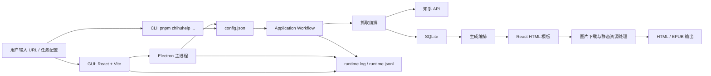
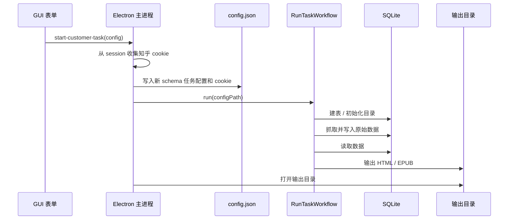
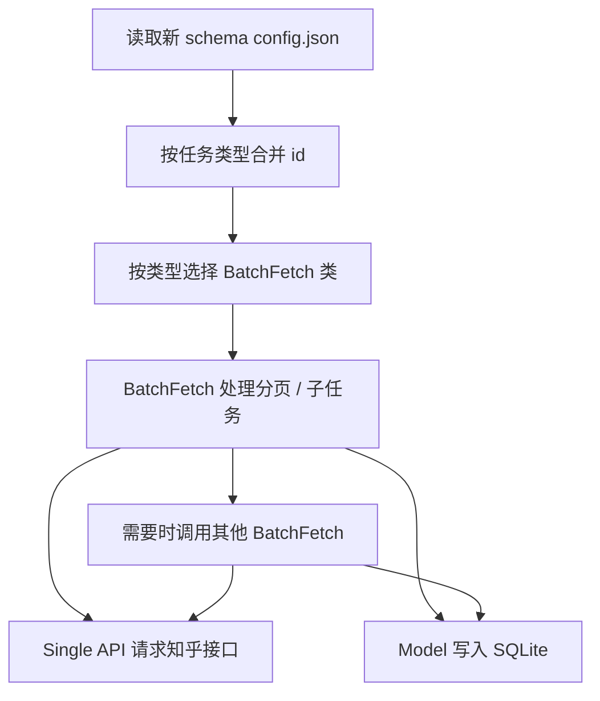
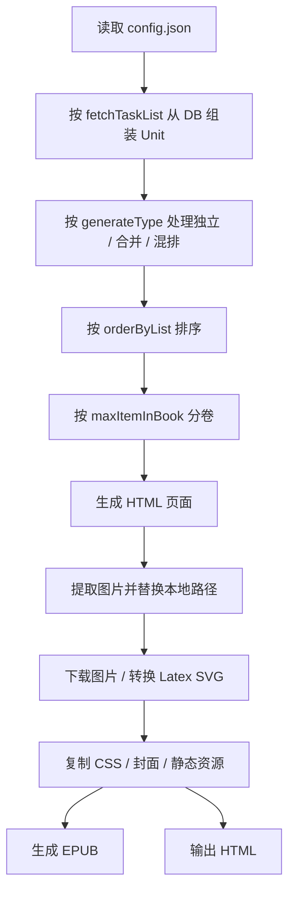

# 项目架构与工作流

本文描述知乎助手当前代码的真实架构和完整工作流程，供新人理解项目，也作为下一轮架构规范化改造的依据。

## 项目定位

知乎助手是一个本地桌面工具，用于将知乎上的回答、文章、想法、收藏夹、话题、专栏和用户内容抓取到本地 SQLite 数据库，并生成 HTML 与 EPUB 电子书。

项目有两种使用入口：

| 入口   | 主要文件                     | 用途                                                 |
| ------ | ---------------------------- | ---------------------------------------------------- |
| 命令行 | `src/interface/cli`、`src/application/workflow` | 直接执行初始化、抓取、生成命令                       |
| GUI    | `src/index.ts`、`client/src` | 通过 Electron 登录知乎、配置任务、查看日志和启动命令 |

## 总体架构

从职责上看，当前项目可以分为六层：

| 层级            | 目录或文件                                                 | 当前职责                                             |
| --------------- | ---------------------------------------------------------- | ---------------------------------------------------- |
| 交互层          | `client/src`、`src/preload.js`                             | 任务配置、登录、日志展示、数据库摘要展示             |
| Electron 调度层 | `src/index.ts`                                             | 创建窗口、管理 cookie、提供 IPC、调用 application workflow |
| CLI 层          | `src/interface/cli`                                        | 解析命令行参数并派发 workflow                        |
| 应用层          | `src/application/workflow`                                 | 初始化环境、派发抓取、派发生成                       |
| 抓取层          | `src/api/single`、`src/api/batch`                          | 请求知乎接口、分页抓取、调用模型入库                 |
| 数据层          | `src/model`、`src/library/knex.ts`、`src/infrastructure/sqlite/schema/init.sql` | SQLite 表初始化、数据读写、摘要统计                  |
| 生成层          | `src/application/workflow/generate`、`src/library/epub`    | 数据聚合、排序、分卷、HTML 渲染、图片处理、EPUB 打包 |

## 关键文件

| 文件                                        | 说明                                          |
| ------------------------------------------- | --------------------------------------------- |
| `package.json`                              | 根项目脚本、Electron 打包配置、Node/pnpm 约束 |
| `pnpm-workspace.yaml`                       | workspace 配置，包含根项目和 `client`         |
| `config.json`                               | 运行时任务配置和知乎请求配置                  |
| `runtime.log` / `runtime.jsonl`             | 命令执行与 GUI 展示共用的文本日志和结构化日志 |
| `src/config/path.ts`                        | 缓存、输出、配置、日志等路径定义              |
| `src/config/common.ts`                      | 数据库版本、升级接口、请求超时等公共配置      |
| `src/config/request.ts`                     | 当前请求使用的 cookie 与 UA                   |
| `src/type/task_config.d.ts`                 | 根项目任务配置类型                            |
| `client/src/resource/type/task_config.d.ts` | 前端任务配置类型                              |

## 任务配置

命令行任务配置的核心结构是新 schema：

| 字段             | 说明                                                              |
| ---------------- | ----------------------------------------------------------------- |
| `tasks`          | 待抓取任务列表，每项包含任务类型、目标 id、原始输入和是否跳过抓取 |
| `generate`       | 生成配置，包含书名、图片质量、分卷数量、排序规则和输出格式        |
| `request`        | 请求配置，包含 UA 和 cookie                                       |

GUI 当前仍使用前端表单结构，交给 Electron 主进程后会转换为新 schema 并写入 `config.json`。命令行模式直接读取新 schema 的 `config.json`。

当前支持的任务类型集中在 `src/constant/task_config.ts`：

| 类型                    | 含义                 |
| ----------------------- | -------------------- |
| `author-answer`         | 用户的所有回答       |
| `author-ask-question`   | 用户提问过的所有问题 |
| `author-article`        | 用户发布的所有文章   |
| `author-pin`            | 用户发布的所有想法   |
| `author-agree-answer`   | 用户赞同过的所有回答 |
| `author-agree-article`  | 用户赞同过的所有文章 |
| `author-watch-question` | 用户关注过的所有问题 |
| `block-account-answer`  | 销号用户的所有回答   |
| `topic`                 | 话题                 |
| `collection`            | 收藏夹               |
| `column`                | 专栏                 |
| `article`               | 单篇文章             |
| `question`              | 单个问题             |
| `answer`                | 单个回答             |
| `pin`                   | 单条想法             |

## GUI 工作流程

GUI 由 `client/src/page/home` 组织，当前有四个标签页：

| 页面     | 组件                      | 说明                                                   |
| -------- | ------------------------- | ------------------------------------------------------ |
| 任务管理 | `component/customer_task` | 输入 URL、识别任务类型、排序、图片质量、分卷、启动任务 |
| 运行日志 | `component/log`           | 每 2 秒读取 `runtime.log` 并滚动展示                   |
| 数据浏览 | `component/db_explorer`   | 调用摘要接口展示数据库中内容数量                       |
| 登录     | `component/login`         | 用 webview 登录知乎，使 Electron session 获得 cookie   |

GUI 与主进程通过 `src/preload.js` 暴露的 `window.electronAPI` 通信：

| IPC                         | 用途                     |
| --------------------------- | ------------------------ |
| `get-common-config`         | 读取 `config.json`       |
| `start-customer-task`       | 保存配置并启动完整任务   |
| `get-task-default-title`    | 根据任务 id 获取默认书名 |
| `zhihu-http-get`            | 由主进程代理知乎请求     |
| `get-db-summary-info`       | 获取数据库摘要           |
| `get-log-content`           | 读取运行日志             |
| `clear-log-content`         | 清空运行日志             |
| `open-output-dir`           | 打开输出目录             |
| `clear-all-session-storage` | 清空登录状态             |

### GUI 启动任务时序

## 命令行工作流程

命令行入口是 `src/interface/cli/main.ts`。它会执行三个动作：

1.  使用 Optique 解析 `init`、`fetch`、`generate`、`run` 子命令。
2.  将解析后的 `CliCommand` 派发给 `RunTaskWorkflow`。
3.  workflow 创建 `RunContext`，设置配置、数据库和输出路径，再执行对应阶段。

常见命令：

| 命令                                             | 说明                        |
| ------------------------------------------------ | --------------------------- |
| `pnpm zhihuhelp init --config config.json`       | 初始化目录和数据库          |
| `pnpm zhihuhelp init --config config.json --rebase` | 删除当前数据库并重建表   |
| `pnpm zhihuhelp fetch --config config.json`      | 按 `config.json` 抓取数据   |
| `pnpm zhihuhelp generate --config config.json`   | 按 `config.json` 生成电子书 |
| `pnpm zhihuhelp run --config config.json`        | 执行完整链路                |

## 初始化流程

`src/application/workflow/init/init_workflow.ts` 负责初始化：

1.  调用升级接口检查新版本。
2.  创建 `PathConfig.allPathList` 中定义的缓存和输出目录。
3.  如果带 `--rebase`，删除当前版本 SQLite 文件。
4.  执行 `src/infrastructure/sqlite/schema/init.sql` 建表。

数据库文件由 `src/config/common.ts` 中的 `db_version` 决定，目前为 `zhihu_v1.0.2.sqlite`。

## 抓取工作流程

抓取入口是 `src/application/workflow/fetch/customer.ts`。

当前抓取分为两层：

| 层级       | 目录             | 说明                                                       |
| ---------- | ---------------- | ---------------------------------------------------------- |
| single API | `src/api/single` | 只封装单次知乎接口请求，例如问题详情、回答列表、收藏夹信息 |
| batch API  | `src/api/batch`  | 负责分页、批量抓取、任务队列、入库、调用其他 batch         |

`src/api/batch/base.ts` 提供 `fetchListAndSaveToDb`，会把多个 id 加入 `CommonUtil.taskManager`，再等待任务完成。`TaskManager` 内部维护两个队列：

| 队列                  | 用途                             |
| --------------------- | -------------------------------- |
| `directTaskPool`      | 不需要节流保护的任务，如图片下载 |
| `taskWithProtectPool` | 需要节流保护的知乎请求           |

抓取层会把知乎接口返回的原始 JSON 存到 SQLite。回答、文章、想法是原子内容；收藏夹、话题、专栏、用户活动等是集合或关系数据。

## 数据存储

数据库表由 `src/command/init.sql` 创建：

| 表                    | 说明                                               |
| --------------------- | -------------------------------------------------- |
| `Answer`              | 回答原始数据，附带问题 id、作者 id、作者 url_token |
| `Pin`                 | 想法原始数据                                       |
| `Article`             | 文章原始数据                                       |
| `Column`              | 专栏信息                                           |
| `Author`              | 作者信息                                           |
| `Activity`            | 用户行为记录                                       |
| `Collection`          | 收藏夹信息                                         |
| `Collection_Record`   | 收藏夹内 answer/pin/article 记录                   |
| `Topic`               | 话题信息                                           |
| `Topic_Answer`        | 话题精华回答关系                                   |
| `Author_Ask_Question` | 用户提问过的问题关系                               |

数据层目前采用静态 Model 类，例如 `MAnswer.asyncReplaceAnswer`、`MCollection.asyncGetCollectionRecordList`。大多数表保存 `raw_json`，生成阶段再反序列化为知乎原始类型。

## 生成工作流程

生成入口是 `src/application/workflow/generate/customer.ts`。

生成层中的核心概念：

| 概念           | 当前实现                                                              | 说明                                       |
| -------------- | --------------------------------------------------------------------- | ------------------------------------------ |
| Page           | `Page_Question`、`Page_Article`、`Page_Pin`                           | 电子书中的内容页                           |
| Unit           | `Unit_用户`、`Unit_收藏夹`、`Unit_话题`、`Unit_专栏`、`Unit_混合类型` | 一组页面和一个信息页                       |
| Ebook Column   | `Ebook_Column`                                                        | 一本或一卷电子书                           |
| HTML Render    | `html_render`                                                         | 用 React 模板渲染 HTML                     |
| Epub Generator | `epub_generator.ts`                                                   | 图片、静态资源、HTML 缓存、EPUB 打包和输出 |

输出目录由 `PathConfig` 定义：

| 目录                        | 说明           |
| --------------------------- | -------------- |
| `缓存文件/imgPool`          | 图片缓存       |
| `缓存文件/html`             | HTML 生成缓存  |
| `缓存文件/epub`             | EPUB 生成缓存  |
| `知乎助手输出的电子书/html` | 最终 HTML 输出 |
| `知乎助手输出的电子书/epub` | 最终 EPUB 输出 |

## 日志流程

日志统一通过 `src/library/logger.ts` 写入：

1.  `Logger.log` / `Logger.warn` 格式化时间和参数。
2.  同步追加到 `runtime.log`。
3.  同时输出到控制台。
4.  GUI 日志页定时调用 `get-log-content` 读取文件。
5.  Electron 主进程在日志超过 5000 行时截断为最近 2000 行。

当前日志是纯文本形式，适合直接阅读，但不方便按任务、阶段、实体 id 过滤。

## 当前架构特征

1.  项目工作流清晰：配置任务、抓取入库、读取数据库、生成输出。
2.  数据抓取、入库、生成已经有基本分层，但边界并不严格。
3.  GUI 和命令行复用同一份命令体系，这是好的方向。
4.  原始知乎响应以 `raw_json` 保存，便于快速兼容接口变化，但也让类型边界后移到生成阶段。
5.  全局任务池和全局请求配置降低了改造成本，但也带来隐式状态和调试困难。

详细问题和下一轮改造方案见 [架构规范化改造方案.md](架构规范化改造方案.md)。
